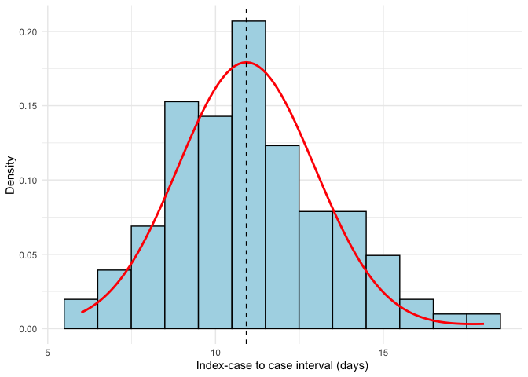
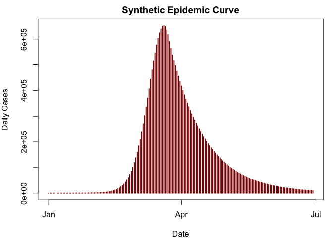
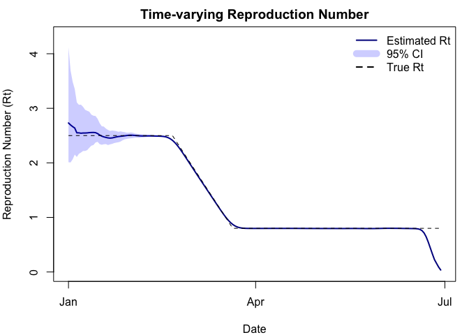

<!-- README.md is generated from README.Rmd. Please edit that file -->

# The `mitey` package

<!-- badges: start -->

[](https://github.com/kylieainslie/mitey/actions/workflows/R-CMD-Check.yaml)
[](https://joinup.ec.europa.eu/collection/eupl/eupl-text-eupl-12)

[](https://doi.org/10.5281/zenodo.15446456)

<!--[](https://CRAN.R-project.org/package=your-package) -->

<!-- [](https://codecov.io/gh/kylieainslie/mitey) -->

<!--[](https://CRAN.R-project.org/package=mitey) -->

<!-- badges: end -->

The `mitey` package is a lightweight package designed originally as a
companion to the analyses presented by [Ainslie et
al. 2025](http://dx.doi.org/10.2139/ssrn.5184990) on scabies
transmission. However, these methods are more widely applicable than in
the context of scabies, thus the motivation behind creating the `mitey`
package was twofold and also provides flexible, documented code for
methods to estimate epidemiological quantities of interest.

Currently, `mitey` includes methods to estimate a) the mean and standard
deviation of the serial interval distribution using a maximum likelihood
framework developed by [Vink et
al. 2014](https://doi.org/10.1093/aje/kwu209) and b) the time-varying
reproduction number using the method developed by [Walling and Lipsitch
2007](https://pmc.ncbi.nlm.nih.gov/articles/PMC1766383/).

### Estimating the serial interval

The method developed by Vink et al. uses data about the time of symptom
onset with no precise information about transmission pairs and an
assumed underlying serial interval distribution (either Gaussian or
Gamma) to estimate the mean and standard deviation of the serial
interval distribution. Briefly, the method involves calculating the
index case-to-case (ICC) interval for each person, where the person with
the earliest date of symptom onset will be considered the index case.
The rest of the individuals will have an ICC interval calculated as the
number of days between their symptom onset and the index case.

## Installation

1.  Install [R](http://cran.r-project.org)

2.  Install the development version of mitey from
    [GitHub](https://github.com/kylieainslie/mitey):

``` r
# install.packages("devtools")
devtools::install_github("kylieainslie/mitey")
```

## Example Usage

``` r
library(mitey)

#-----------------
# Serial Interval Estimation
#-----------------
icc_intervals <- c(rep(6,4),rep(7,8),rep(8,14),rep(9,31),rep(10,29),rep(11,42),rep(12,25),rep(13,16),rep(14,16), rep(15,10),rep(16,4),rep(17,2),rep(18,2))

# Estimate serial interval
si_results <- si_estim(icc_intervals)
si_results
#> $mean
#> [1] 10.91892
#> 
#> $sd
#> [1] 2.036239
#> 
#> $wts
#> [1] 3.625090e-02 9.146057e-01 3.012069e-16 4.913656e-02 7.797502e-22
#> [6] 6.801913e-06 6.863119e-28
```

``` r
# Plot fitted serial interval distribution
plot_si_fit(
  dat = icc_intervals,
  mean = si_results$mean[1],
  sd = si_results$sd[1],
  weights = c(si_results$wts[1], 
              si_results$wts[2] + si_results$wts[3],
              si_results$wts[4] + si_results$wts[5], 
              si_results$wts[6] + si_results$wts[7]),
  dist = "normal"
)
```



``` r
#-----------------
# Time-varying Reproduction Number Estimation
#-----------------
# Generate a synthetic epidemic using the generate_synthetic_epidemic function
set.seed(123)
true_r <- c(rep(2.5, 50), seq(2.5, 0.8, length.out = 30), rep(0.8, 100))

# Generate synthetic epidemic data
synthetic_data <- generate_synthetic_epidemic(
  true_r = true_r,      # Time-varying reproduction number
  si_mean = 5.2,        # Mean serial interval (days)
  si_sd = 1.72,         # SD of serial interval
  si_dist = "gamma",    # Distribution type
  initial_cases = 10    # Initial number of cases
)

incidence <- synthetic_data$incidence
dates <- synthetic_data$date
```



``` r
# Estimate time-varying reproduction number 
results <- wallinga_lipsitch(
  incidence = incidence, 
  dates = dates,
  si_mean = 5.2,          # mean serial interval in days
  si_sd = 1.72,           # serial interval SD
  si_dist = "gamma",      # serial interval distribution
  smoothing = 7,          # 7-day smoothing window
  bootstrap = TRUE,       # calculate bootstrap confidence intervals
  n_bootstrap = 100,      # number of bootstrap samples
  conf_level = 0.95       # 95% confidence intervals
)

head(results)
#>         date incidence        R R_corrected  R_lower  R_upper R_corrected_lower
#> 1 2023-01-01        10 2.731039    2.731039 2.011146 4.120939          2.011146
#> 2 2023-01-02         0 2.694590    2.694590 2.008012 3.692239          2.008012
#> 3 2023-01-03         1 2.664286    2.664286 2.064334 3.486878          2.064334
#> 4 2023-01-04         3 2.638675    2.638675 2.151772 3.354107          2.151772
#> 5 2023-01-05         9 2.550425    2.550425 2.108557 3.108038          2.108557
#> 6 2023-01-06        11 2.550200    2.550200 2.165532 3.064228          2.165532
#>   R_corrected_upper
#> 1          4.120939
#> 2          3.692239
#> 3          3.486878
#> 4          3.354107
#> 5          3.108038
#> 6          3.064228
```



## Main Functions

| Function | Description |
|----|----|
| `si_estim()` | Estimates the mean and standard deviation of the serial interval distribution |
| `plot_si_fit()` | Plots the fitted serial interval distribution |
| `wallinga_lipsitch()` | Estimates the time-varying reproduction number using the Wallinga & Lipsitch method |
| `generate_synthetic_epidemic()` | Generates a synthetic epidemic curve with specified parameters for testing and simulation |

## Vignettes

- A quick start guide showing examples of how to estimate the serial
  interval and time-varying reproduction number can be found
  [here](https://kylieainslie.github.io/mitey/articles/quick_start_guide.html).

- A script that reproduces the results from [Ainslie et
  al. 2025](http://dx.doi.org/10.2139/ssrn.5184990) can be found
  [here](https://kylieainslie.github.io/mitey/articles/reproduce_results_ainslie_et_al.html).

- Validation of the method used to estimate the mean and standard
  deviation of the serial interval proposed by [Vink et
  al. 2014](https://doi.org/10.1093/aje/kwu209) can be found
  [here](https://kylieainslie.github.io/mitey/articles/code_validation_for_Vink_method.html).

- Validation of the method used to estimate the time-varying
  reproduction number proposed by [Wallinga and Lipsitch
  2007](https://pmc.ncbi.nlm.nih.gov/articles/PMC1766383/) can be found
  [here](https://kylieainslie.github.io/mitey/articles/rt_estimation_validation.html).

## Data

Several data files are stored in the repo so that the results presented
in [Ainslie et al. 2025](http://dx.doi.org/10.2139/ssrn.5184990) are
reproducible. Data files are stored in `inst/extdata/data/`. Below is a
brief description of the different files.

- `si_data.rds`
  - Description: Data on date of symptom onset for scabies outbreaks
    described by Kaburi et al., Akunzirwe et al., Tjon-Kon-Fat et al.,
    and Ariza et al. For all outbreaks except Kaburi et al. the raw data
    was not available, thus the date of symptom onset data had to be
    reconstructed using the epidemic curve provided in the manuscript.
    The original data from Kaburi et al. is also available in the `data`
    directory (`Kaburi_et_al_data_scabies.xlsx`).
  - *Source*:
    - [Kaburi et al.](https://doi.org/10.1186/s12889-019-7085-6),
    - [Akunzirwe et al.](https://doi.org/10.21203/rs.3.rs-3205380/v1),
    - [Tjon-Kon-Fat et
      al.](https://doi.org/10.1371/journal.pntd.0009485)
    - [Ariza et al.](https://doi.org/10.1007/s10096-012-1752-1).
- `scabies_data_yearly.xlsx`
  - *Description:* Annual scabies incidence per 1000 people in the
    Netherlands from 2011-2023.
  - *Source:* [Nivel](https://www.nivel.nl/nl/zorg-en-ziekte-in-cijfers)
- `scabies_data_consultation_weekly.xslx`
  - *Description:* Weekly numbers of persons consulting for scabies (per
    100,000 people) from 2011 to 2023 in the Neltherlands as diagnosed
    by general practitioners (GPs). *Note:* Individuals in institutions
    (e.g., care homes, prisons) usually have their own health care
    provider and are generally not taken into account in GP
    registrations.
  - *Source:* Nivel

## License

This package is distributed under the European Union Public License
(EUPL) v1.2. See LICENSE file for details.

## Citation

If you use mitey in your research, please cite:

    Ainslie, K. (2025). mitey: Toolkit to Estimate Infectious Disease Dynamics Parameters. R package version 0.1.0. https://github.com/kylieainslie/mitey

And the original methodological papers:

- Vink et al. (2014). Serial intervals of respiratory infectious
  diseases: A systematic review and analysis. American Journal of
  Epidemiology, 180(9), 865-875.
- Wallinga, J., & Lipsitch, M. (2007). How generation intervals shape
  the relationship between growth rates and reproductive numbers.
  Proceedings of the Royal Society B: Biological Sciences, 274(1609),
  599-604.

## Contributing

Contributions to `mitey` are welcome! Please feel free to submit a pull
request or open an issue to discuss potential improvements or report
bugs.

<!--You'll still need to render `README.Rmd` regularly, to keep `README.md` up-to-date. `devtools::build_readme()` is handy for this. -->
