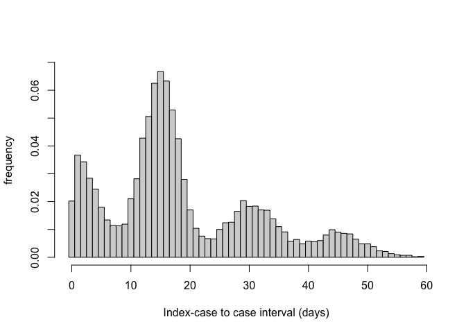
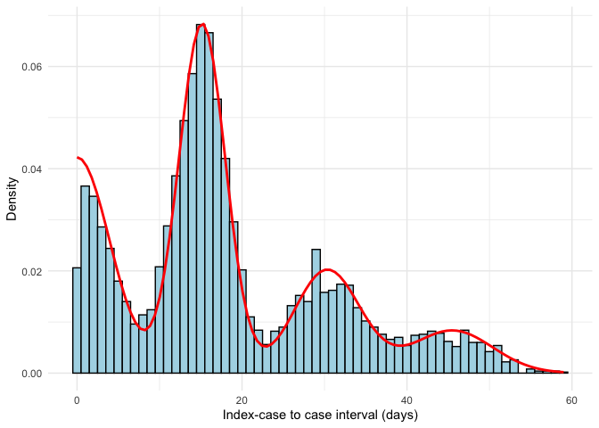

<!-- README.md is generated from README.Rmd. Please edit that file -->

# The `mitey` package

<!-- badges: start -->
<!-- [](https://github.com/kylieainslie/mitey/actions/workflows/R-CMD-check.yaml) -->
<!--[](https://CRAN.R-project.org/package=your-package) -->
<!-- [](https://codecov.io/gh/kylieainslie/mitey) -->
<!-- [](./LICENSE) -->
<!--  -->
<!-- [](https://doi.org/<DOI>)  -->
<!--[](https://CRAN.R-project.org/package=mitey) -->
<!-- badges: end -->

The `mitey` package is a lightweight package designed originally as a
companion to the analyses presented by [Ainslie et
al. 2025](http://dx.doi.org/10.2139/ssrn.5184990)
on scabies transmission. However, these methods are more widely
applicable than in the context of scabies, thus the motivation behind
creating the `mitey` package was twofold and also provides flexible,
documented code for methods to estimate epidemiological quantities of
interest.

Currently, `mitey` includes methods to estimate a) the mean and standard
deviation of the serial interval distribution using a maximum likelihood
framework developed by [Vink et
al. 2014](https://doi.org/10.1093/aje/kwu209) and b) the time-varying
reproduction number using the method developed by [Walling and Lipsitch
2007](https://pmc.ncbi.nlm.nih.gov/articles/PMC1766383/).

### Estimating the serial interval

The method developed by Vink et al. uses data about the time of symptom
onset with no precise information about transmission pairs and an
assumed underlying serial interval distribution (either Gaussian or
Gamma) to estimate the mean and standard deviation of the serial
interval distribution. Briefly, the method involves calculating the
index case-to-case (ICC) interval for each person, where the person with
the earliest date of symptom onset will be considered the index case.
The rest of the individuals will have an ICC interval calculated as the
number of days between their symptom onset and the index case.

## Installation

1.  Install [R](http://cran.r-project.org)

2.  Install the development version of mitey from
    [GitHub](https://github.com/kylieainslie/mitey):

``` r
# install.packages("devtools")
devtools::install_github("kylieainslie/mitey")
```

## Vignettes

- The manuscript pre-print that motivated the development of this
  package can be found
  [here](https://kylieainslie.github.io/mitey/articles/epidemiology_of_scabies.html).

- A script that reproduces the results from [Ainslie et
  al. 2025](http://dx.doi.org/10.2139/ssrn.5184990)
  can be found
  [here](https://kylieainslie.github.io/mitey/articles/reproduce_results_ainslie_et_al.html).

- Validation of the method used to estimate the mean and standard
  deviation of the serial interval proposed by [Vink et
  al. 2014](https://doi.org/10.1093/aje/kwu209) can be found
  [here](https://kylieainslie.github.io/mitey/articles/code_validation_for_Vink_method.html).

- Validation of the method used to estimate the time-varying
  reproduction number proposed by [Wallinga and Lipsitch
  2007](https://pmc.ncbi.nlm.nih.gov/articles/PMC1766383/) can be found
  [here](https://kylieainslie.github.io/mitey/articles/rt_estimation_validation.html).

## Data

Several data files are stored in the repo so that the results presented
in [Ainslie et
al. 2025](http://dx.doi.org/10.2139/ssrn.5184990)
are reproducible. Data files are stored in `inst/extdata/data/`. Below
is a brief description of the different files.

- `si_data.rds`
  - Description: Data on date of symptom onset for scabies outbreaks
    described by Kaburi et al., Akunzirwe et al., Tjon-Kon-Fat et al.,
    and Ariza et al. For all outbreaks except Kaburi et al. the raw data
    was not available, thus the date of symptom onset data had to be
    reconstructed using the epidemic curve provided in the manuscript.
    The original data from Kaburi et al. is also available in the `data`
    directory (`Kaburi_et_al_data_scabies.xlsx`).
  - *Source*:
    - [Kaburi et al.](https://doi.org/10.1186/s12889-019-7085-6),
    - [Akunzirwe et al.](https://doi.org/10.21203/rs.3.rs-3205380/v1),
    - [Tjon-Kon-Fat et
      al.](https://doi.org/10.1371/journal.pntd.0009485)
    - [Ariza et al.](https://doi.org/10.1007/s10096-012-1752-1).
- `scabies_data_yearly.xlsx`
  - *Description:* Annual scabies incidence per 1000 people in the
    Netherlands from 2011-2023.
  - *Source:* [Nivel](https://www.nivel.nl/nl/zorg-en-ziekte-in-cijfers)
- `scabies_data_consultation_weekly.xslx`
  - *Description:* Weekly numbers of persons consulting for scabies (per
    100,000 people) from 2011 to 2023 in the Neltherlands as diagnosed
    by general practitioners (GPs). *Note:* Individuals in institutions
    (e.g., care homes, prisons) usually have their own health care
    provider and are generally not taken into account in GP
    registrations.
  - *Source:* Nivel

## Example

This is a basic example of estimating the mean serial interval from data
on time of symptom onset for an infectious disease. We first simulate
index case-to-case (ICC) intervals. Here, we directly simulate the ICC
intervals based on their route of transmission. The specified mean
serial interval `hmu` is 15 and the specified standard deviation
`hsigma` is 3. The weights for each route of transmission are specified
as `hw1`, `hw2`, `hw3`, and `hw4`, respectively.

``` r
library(mitey)
library(fdrtool)
```

``` r
set.seed(1234)

N <- 5000; hmu<-15; hsigma<-3; hw1 <- 0.2; hw2 <- 0.5; hw3 <- 0.2; hw4 <- 0.1

CP <- rhalfnorm((hw1*N),theta=sqrt(pi/2)/(sqrt(2)*hsigma))
PS <- rnorm(hw2*N,mean=hmu,sd=hsigma)
PT <- rnorm(hw3*N,mean=2*hmu,sd=sqrt(2)*hsigma)
PQ <- rnorm(hw4*N,mean=3*hmu,sd=sqrt(3)*hsigma)

sim_data <- round(c(CP,PS,PT,PQ))
```

We can look at our simulated data by plotting them as a histogram.

<div class="figure">


<p class="caption">
Figure 1. Histogram of index-case to case intervals (in days) for
simulated data.
</p>

</div>

Then, we estimate the mean and standard deviation of the simulated
serial interval using the `si_estim` function.

``` r
results <- si_estim(sim_data)
results
#> $mean
#> [1] 15.16373
#> 
#> $sd
#> [1] 2.823293
#> 
#> $wts
#> [1] 2.113966e-01 4.841131e-01 7.836824e-09 2.021913e-01 3.062666e-15
#> [6] 1.022991e-01 1.368660e-21
```

The output of `si_estim` is a named list with elements `mean`, `sd`, and
`wts`, which contain the estimated mean, standard deviation, and weights
of the serial interval distribution, respectively. We see that using the
simulated data and assuming an underlying normal distribution, we obtain
estimates very close to the input values: a mean serial interval
estimate of 15.16 and a standard deviation of 2.82. We are also able to
recapture the input weights: hw1 = 0.21, hw2 = 0.48, hw3 = 0.2, hw4 =
0.1.

Using the `plot_si_fit` function, we can use the outputs of `si_estim`
to plot the fitted serial interval over the symptom onset data.

``` r
plot_si_fit(
    dat = sim_data,
    mean = results$mean[1],
    sd = results$sd[1],
    weights = c(results$wts[1], results$wts[2] + results$wts[3],
                results$wts[4] + results$wts[5], results$wts[6] + results$wts[7]),
    dist = "normal"
  )
```

<div class="figure">


<p class="caption">
Figure 2. Fitted serial interval curves plotted over symptom onset data
for simulated symptom onset data. Red line is the fitted serial interval
curves assuming an underlying Normal distribution.
</p>

</div>

<!--You'll still need to render `README.Rmd` regularly, to keep `README.md` up-to-date. `devtools::build_readme()` is handy for this. -->
