# Flexible Number of Transmission Routes and accounting for date uncertainty in Serial Interval Estimation

------------------------------------------------------------------------

## Introduction — Why does the serial interval matter?

The **serial interval** (SI) is defined as the time elapsed between
symptom onset in a primary case (the infector) and symptom onset in the
secondary case they directly infected (Vink, Bootsma, and Wallinga
2014).


Figure 1 — Definition of the serial interval

In epidemiology, the serial interval is a fundamental parameter for
several reasons:

- **Quantifying the speed of spread.** A short SI means that successive
  generations of cases follow one another rapidly, making the epidemic
  harder to contain. A long SI leaves more time to detect and isolate
  cases before they transmit further.
- **Estimating the reproduction number.** Both the basic reproduction
  number $R_{0}$ and the time-varying reproduction number $R_{t}$ are
  linked to the SI through the renewal equation: without an accurate SI
  estimate, any estimate of $R_{t}$ will be biased.
- **Input into transmission models.** Compartmental models (SIR, SEIR,
  etc.) and renewal equation models use the SI as a direct input to
  simulate epidemic dynamics and evaluate the impact of interventions.
- **Designing control measures.** The duration of quarantine, the
  contact-tracing window, and the timing of vaccination campaigns are
  all partly calibrated on the SI.

In practice, the SI is used as a proxy for the **generation interval**
(the time between infection of the primary case and infection of the
secondary case) which is usually unobservable.

------------------------------------------------------------------------

## How is the serial interval estimated?

### Data requirements

Ideally, one would have transmission pairs (infector, infectee)
identified with certainty through epidemiological investigation or
genomic sequencing. In that setting, the SI is estimated directly as the
difference in symptom onset dates.

In practice, such data are rare. The most common alternatives are:

| Approach                       | Data required                          | Main sources of bias                   |
|--------------------------------|----------------------------------------|----------------------------------------|
| Direct infector–infectee pairs | Contact-tracing surveys                | Epidemic growth bias, right-truncation |
| Outbreak data (ICC intervals)  | Symptom onset dates within an outbreak | Multiple transmission routes (see §3)  |
| Bayesian reconstruction        | Partial transmission tree              | Strongly prior-dependent               |

### Classical biases and corrections

Several biases affect SI estimation from observed data:

- **Epidemic growth bias.** During epidemic growth, infector–infectee
  pairs with short SIs are over-represented in surveillance data,
  because recent infectors are more likely to still be under
  observation.
- **Right-truncation.** Secondary cases whose symptoms appear after the
  study end date are not observed, artificially shortening the estimated
  SI.
- **Negative serial intervals.** When the secondary case develops
  symptoms before the identified infector (pre-symptomatic
  transmission), the observed SI is negative.

These corrections are well documented in the literature but require
additional assumptions. It is precisely to sidestep some of these
difficulties that outbreak-based methods were developed.

------------------------------------------------------------------------

## The Vink et al. method

### ICC data (*Index Case-to-Case intervals*)

In a household or institutional setting (care home, school classroom),
the **index case** — the first person to show symptoms — is identified,
and the symptom onset date of every other case is recorded. The
difference between the index case onset date and each subsequent case
onset date is an **ICC interval**.

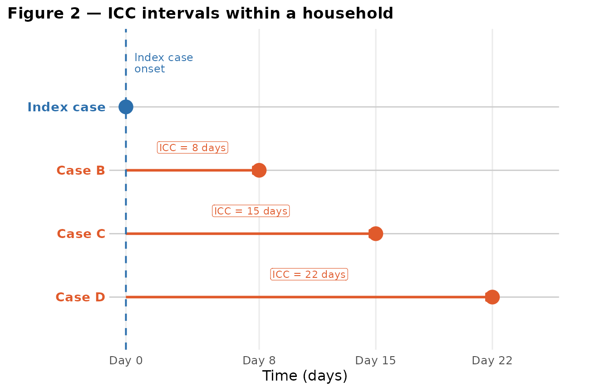

The appeal of ICC data is their availability: they do not require
identifying exactly who infected whom, only that symptom onset dates are
recorded within a well-defined group.

### The mixture model: transmission routes

The key insight of Vink et al. is that each observed ICC can correspond
to **several distinct transmission scenarios**, called routes:

- **Co-primary (CP):** Both the index case and the observed case were
  infected by the same external source at roughly the same time. The ICC
  reflects variability in incubation, not the SI. Expected distribution:
  half-normal centred at zero.
- **Primary-Secondary (PS):** The index case directly infected the
  observed case. ICC ≈ SI. Distribution:
  $N\left( \mu,\sigma^{2} \right)$.
- **Primary-Tertiary (PT):** The index case infected an asymptomatic
  intermediate, who then infected the observed case. ICC ≈ 2 × SI.
  Distribution: $N\left( 2\mu,2\sigma^{2} \right)$.
- **Primary-Quaternary (PQ):** Two asymptomatic intermediates between
  the index case and the observed case. ICC ≈ 3 × SI. Distribution:
  $N\left( 3\mu,3\sigma^{2} \right)$.

&nbsp;

    #> Warning: Removed 36 rows containing non-finite outside the scale range
    #> (`stat_align()`).
    #> Warning: Removed 36 rows containing missing values or values outside the scale range
    #> (`geom_line()`).
    #> Warning: Removed 36 rows containing non-finite outside the scale range
    #> (`stat_align()`).
    #> Warning: Removed 36 rows containing missing values or values outside the scale range
    #> (`geom_line()`).
    #> Warning: Removed 36 rows containing non-finite outside the scale range
    #> (`stat_align()`).
    #> Warning: Removed 36 rows containing missing values or values outside the scale range
    #> (`geom_line()`).
    #> Warning: Removed 36 rows containing non-finite outside the scale range
    #> (`stat_align()`).
    #> Warning: Removed 36 rows containing missing values or values outside the scale range
    #> (`geom_line()`).

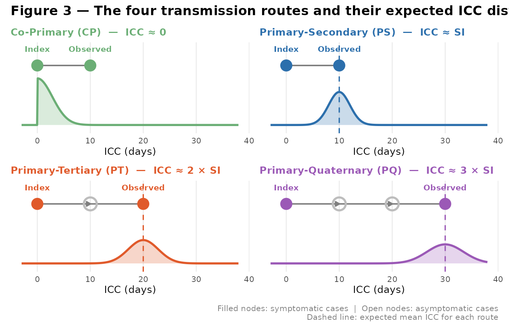

The observed ICC density is therefore a **mixture** of these components:

$$f_{\text{ICC}}(x) = w_{\text{CP}} \cdot f_{\text{CP}}(x) + w_{\text{PS}} \cdot f_{\text{PS}}(x) + w_{\text{PT}} \cdot f_{\text{PT}}(x) + w_{\text{PQ}} \cdot f_{\text{PQ}}(x)$$

where the $w_{k}$ are the route weights (with $\sum w_{k} = 1$), and
$\mu$, $\sigma$ are the underlying SI parameters to be estimated.

### The EM algorithm

The parameters
$\left( \mu,\sigma,w_{\text{CP}},w_{\text{PS}},w_{\text{PT}},w_{\text{PQ}} \right)$
are estimated using an **Expectation-Maximisation (EM)** algorithm:

1.  **E-step.** For each observation $x_{i}$, compute the posterior
    probability that it belongs to each transmission route.
2.  **M-step.** Update $\mu$ and $\sigma$ by maximising the weighted
    likelihood, and recompute the weights $w_{k}$.

These two steps are repeated until convergence. For further technical
details, refer to the *Quick Start Guide* vignette of the `mitey`
package and to Vink, Bootsma, and Wallinga (2014).

``` r
# Basic estimation with 4 routes (default behaviour)
result <- si_estim(icc_data, dist = "normal", n_routes = 4)
result$mean   # Estimated mean serial interval (days)
result$sd     # Estimated standard deviation (days)
```

## Accounting for symptom onset date uncertainty

### The problem

The original Vink et al. method assumes that the reported symptom onset
date is exact. Under this assumption, the likelihood of an observed ICC
value $d$ is computed by integrating the component densities over the
unit interval $\lbrack d,d + 1\rbrack$ (or $\lbrack d - 1,d + 1\rbrack$
when $d > 0$), reflecting only the rounding to the nearest integer day.
In practice, however, the reported date may be off by several days.

### Date reporting uncertainty

A less-discussed but practically important source of bias in serial
interval estimation concerns the **accuracy of the reported symptom
onset date**. In many surveillance systems, the date recorded in the
database is not the true date of symptom onset, but rather the date at
which the case was *reported* to the health authorities.

Several mechanisms can introduce this discrepancy:

- **Weekly reporting cycles.** In some institutional settings (care
  homes, schools), health authorities collect information only once a
  week. For example, a person who developed symptoms on a Wednesday may
  only be recorded on the following Monday, introducing an error of up
  to 6 days.
- **No weekend reporting.** Some surveillance systems do not register
  new cases on Saturdays and Sundays. Cases with symptom onset on Friday
  evening or Saturday will systematically be reported on the following
  Monday.
- **Grouped declaration.** Physicians or hospitals sometimes submit
  batches of cases at fixed intervals, leading to artificial clustering
  of reported onset dates.

The consequence for ICC interval estimation is that the observed ICC is
not
$\Delta t = t_{\text{onset,\ secondary}} - t_{\text{onset,\ index}}$,
but rather
$\Delta t^{*} = t_{\text{reported,\ secondary}} - t_{\text{reported,\ index}}$,
which can differ from the true value by up to $2 \times \texttt{𝚠𝚒𝚗𝚍}$
days (if both the index and the secondary case are subject to reporting
delays in opposite directions).

If a surveillance system collects data once a week, any ICC value
computed from these dates carries an uncertainty of up to
$\pm \texttt{𝚠𝚒𝚗𝚍}$ days around the true value.

    #> Warning: `geom_errorbarh()` was deprecated in ggplot2 4.0.0.
    #> ℹ Please use the `orientation` argument of `geom_errorbar()` instead.
    #> This warning is displayed once per session.
    #> Call `lifecycle::last_lifecycle_warnings()` to see where this warning was
    #> generated.


Figure X — Illustration of the reporting window

### A worked example: weekday-only recording

As a concrete illustration, suppose the index case has a symptom onset
drawn uniformly between day 1 and day 14, and the secondary case
develops symptoms a number of days later drawn from a normal
distribution with mean $\mu = 22$ and standard deviation $\sigma = 3$.
Under daily recording, the ICC interval $I = P_{2} - P_{1}$ exactly
follows this normal distribution. Under weekday-only recording, onset
dates falling on weekends are pushed forward to the next Monday,
distorting both the marginal distributions of $P_{1}$ and $P_{2}$ and,
crucially, the distribution of their difference.

``` r
library(extraDistr)

N     <- 1000
mu    <- 22
sigma <- 3

# P1: index case onset, uniformly distributed between day 1 and 14
P1   <- rdunif(n = N, min = 1, max = 14)

# norm: true serial interval drawn from a normal distribution
norm <- trunc(rnorm(n = N, mean = mu, sd = sigma))

# P2: secondary case onset
P2 <- P1 + norm

# I: true ICC interval
ICC <- P2 - P1

breaks1 <- seq(0.5, 15.5, 1)

par(mfrow = c(1, 3))
hist(P1, main = "P1: index case onset\n(Uniform)", xlab = "Days",
     col = "skyblue", breaks = breaks1)
hist(P2, main = "P2: secondary case onset\n(P1 + SI)", xlab = "Days",
     col = "lightgreen")
hist(ICC,  main = "True ICC interval\n(I = P2 - P1)", xlab = "Days",
     col = "cyan")
```

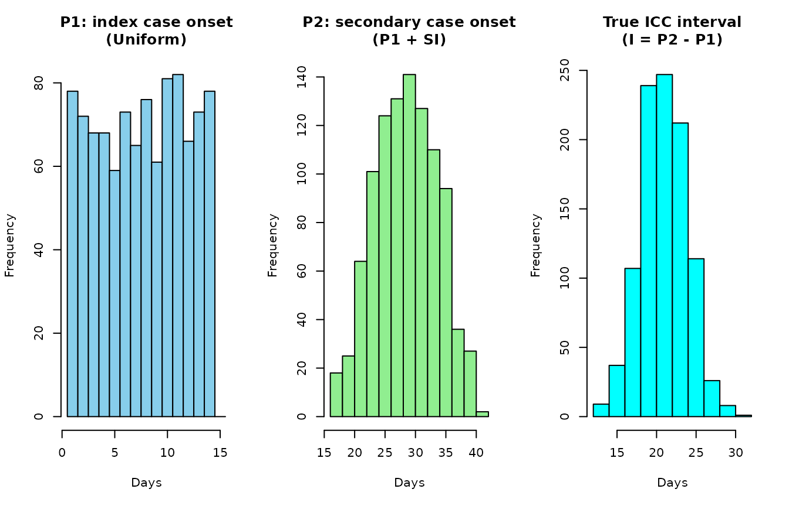

``` r
par(mfrow = c(1, 1))
```

Now suppose that symptom onset dates are only recorded on weekdays.
Dates falling on a Saturday (day $\equiv 6{\ (\operatorname{mod}\ 7)}$)
or Sunday (day $\equiv 0{\ (\operatorname{mod}\ 7)}$) are instead
recorded on the following Monday. This shifts $P_{1}$ and $P_{2}$
forward by up to two days, and the resulting observed ICC interval
$I\prime = P_{2}\prime - P_{1}\prime$ can differ substantially from the
true interval $I$.

``` r
# Shift weekend dates to the following Monday
shift_to_weekday <- function(x) {
  remainder <- x %% 7
  ifelse(remainder == 0 & x > 3, x + 1,
  ifelse(remainder == 6 & x > 3, x + 2, x))
}

P1_prime <- shift_to_weekday(P1)
P2_prime <- shift_to_weekday(P2)
ICC_prime  <- P2_prime - P1_prime

par(mfrow = c(1, 3))
hist(P1_prime, main = "P1': recorded onset\n(weekdays only)", xlab = "Days",
     col = "skyblue", breaks = breaks1)
hist(P2_prime, main = "P2': recorded onset\n(weekdays only)", xlab = "Days",
     col = "lightgreen")
hist(ICC_prime,  main = "Observed ICC interval\n(I' = P2' - P1')", xlab = "Days",
     col = "cyan")
```

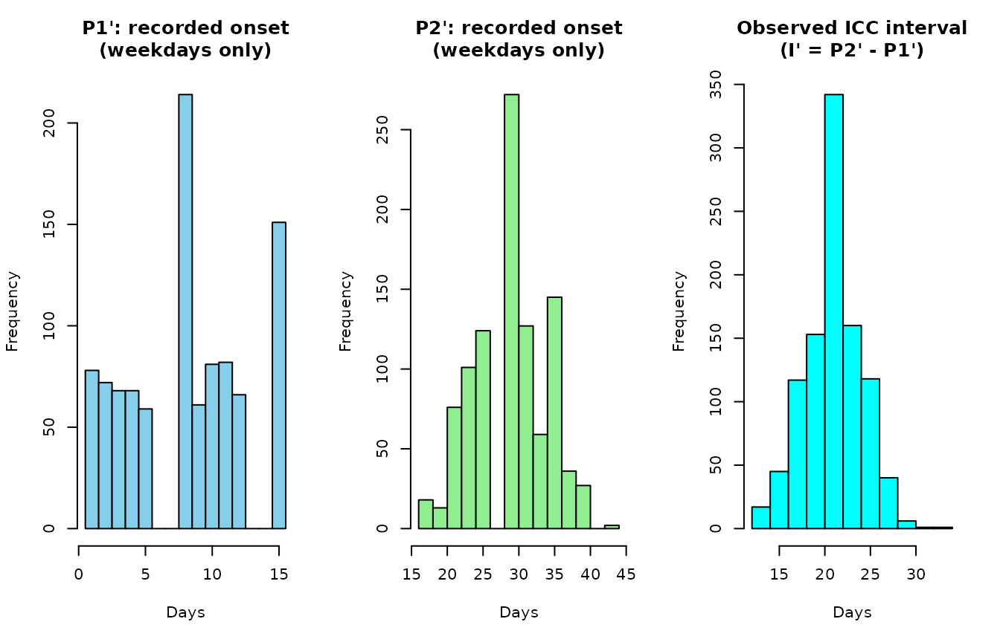

``` r
par(mfrow = c(1, 1))
```

Comparing the two distributions makes the problem clear: the weekday
recording rule creates gaps and spikes in the observed ICC distribution
that have nothing to do with the underlying biology. Feeding these
shifted intervals directly into
[`si_estim()`](https://kylieainslie.github.io/mitey/reference/si_estim.md)
without correction will bias the estimates of $\mu$ and $\sigma$.

### Idea

Instead of treating each observed value $d$ as a point observation,
`mitey` treats it as the **centre of an uncertainty window** of width
`wind`. The true ICC interval is assumed to lie somewhere in
$\lbrack d - w,\; d + w\rbrack$, with probability decreasing as we move
away from $d$.

The likelihood contribution of observation $d$ is therefore not simply
$f_{\text{SI}}(d)$ but the **weighted integral** of the serial interval
density over the window:

$$L(d \mid \mu,\sigma) = \int_{d - w}^{d + w}f_{\text{SI}}(x)\; f_{\bigtriangleup}(x \mid d,w)\; dx$$

where $f_{\bigtriangleup}(x \mid d,w)$ is a **triangular weight
function** centred at $d$, equal to 1 at $x = d$ and falling linearly to
0 at $x = d \pm w$.

### Why a triangular weight?

If both $P_{1}$ and $P_{2}$ can each fall **uniformly** within a window
of width $w$ around their recorded date, the difference $P_{2} - P_{1}$
follows a **triangular distribution** on $\lbrack - w,w\rbrack$ around
the true difference. The triangular weight function directly reflects
this uncertainty structure.

The default value `wind = 1` recovers the original Vink et al. behaviour
exactly.

### Usage

The `wind` parameter is available in
[`si_estim()`](https://kylieainslie.github.io/mitey/reference/si_estim.md),
and is automatically forwarded to all internal integration functions.

``` r
# Default behaviour (wind = 1): exact date assumed
result_default <- si_estim(
  dat  = icc_data,
  dist = "normal",
  wind = 1          # default — equivalent to original Vink method
)

# Weekly reporting cycle (wind = 7)
result_wind7 <- si_estim(
  dat  = icc_data,
  dist = "normal",
  wind = 7
)

# No weekend reporting (wind = 2)
result_wind2 <- si_estim(
  dat  = icc_data,
  dist = "normal",
  wind = 2
)
```

As a rule of thumb:

| Surveillance system         | Recommended `wind` |
|-----------------------------|--------------------|
| Daily reporting, exact date | 1 (default)        |
| No weekend reporting        | 2–3                |
| Twice-weekly reporting      | 3–4                |
| Weekly reporting            | 7                  |
| Bi-weekly reporting         | 14                 |

------------------------------------------------------------------------

## The key limitation: an arbitrarily fixed number of routes

### The problem

In the original formulation of Vink et al., the number of transmission
routes is **fixed at four** (CP, PS, PT, PQ). This choice is reasonable
for many common infectious diseases, where it is unlikely to observe
more than two or three asymptomatic intermediates between the index case
and the observed case.

However, this choice is **arbitrary** and can be ill-suited in two
contrasting situations.

### Highly asymptomatic diseases: the risk of underestimating the number of routes

For some diseases, a substantial fraction of infections remains
asymptomatic. A notable example is **scabies** (*Sarcoptes scabiei*),
for which the incubation period can last several weeks, and infested
individuals can be contagious without showing any visible symptoms for a
long time.

In this context, long transmission chains are plausible: the index case
may have infected one asymptomatic intermediate, who infected another,
who infected yet another, before the observed case finally shows
symptoms.


If such long chains are frequent but the algorithm is limited to 4
routes, the PT or PQ component will absorb ICC values that actually
correspond to routes of order 5 or 6. This leads to **overestimation of
the SI**, because the algorithm assigns an ICC of $5\mu$ to the
component centred at $3\mu$.

### Highly symptomatic diseases: the risk of over-parameterisation

Conversely, for a disease where almost all infections are symptomatic
(e.g. measles or smallpox), it is unlikely that several asymptomatic
intermediates follow one another in a single transmission chain. In this
case, **modelling 4 routes introduces unnecessary parameters** (the
weights for PT and PQ routes will be estimated near zero), at the cost
of precision and numerical stability of the EM algorithm.

A model with only 2 or 3 routes would be more parsimonious and would
yield more stable estimates.

### Summary

| Context                         | Examples          | Recommended routes  | Risk if too low          | Risk if too high                   |
|:--------------------------------|:------------------|:--------------------|:-------------------------|:-----------------------------------|
| Highly asymptomatic disease     | Hepatitis A       | ≥ 5 – 8             | Overestimation of the SI | –                                  |
| Moderately asymptomatic disease | Influenza         | 3 – 5 (default = 4) | Low                      | Low                                |
| Highly symptomatic disease      | Measles, smallpox | 2 – 3               | –                        | Over-parameterisation, instability |

Impact of the number of routes depending on the epidemiological profile
of the disease

------------------------------------------------------------------------

## The new feature: `n_routes` as a user parameter

### Principle

The central modification brought to `mitey` is to **expose the number of
transmission routes as an explicit parameter** of
[`si_estim()`](https://kylieainslie.github.io/mitey/reference/si_estim.md),
rather than hard-coding it to 4. The user can now specify any integer
$\geq 2$.

The default value remains `n_routes = 4` to ensure backward
compatibility with the original behaviour.

### What changed in the code

The change affects several functions in a consistent way:

| Function                                                                                                           | Role                                  | Modification                                                                                   |
|--------------------------------------------------------------------------------------------------------------------|---------------------------------------|------------------------------------------------------------------------------------------------|
| [`si_estim()`](https://kylieainslie.github.io/mitey/reference/si_estim.md)                                         | Main estimation function              | `n_routes` and `wind` parameters added                                                         |
| [`f_norm()`](https://kylieainslie.github.io/mitey/reference/f_norm.md)                                             | Mixture density (normal distribution) | Adapted for $n$ components                                                                     |
| [`f_gam()`](https://kylieainslie.github.io/mitey/reference/f_gam.md)                                               | Mixture density (gamma distribution)  | Adapted for $n$ components                                                                     |
| [`f0()`](https://kylieainslie.github.io/mitey/reference/f0.md)                                                     | Zero-ICC component density            | Integration bound extended to `wind`                                                           |
| [`flower()`](https://kylieainslie.github.io/mitey/reference/flower.md)                                             | Lower-bound component density         | Integration bound extended to `wind`                                                           |
| [`fupper()`](https://kylieainslie.github.io/mitey/reference/fupper.md)                                             | Upper-bound component density         | Integration bound extended to `wind`                                                           |
| [`integrate_component()`](https://kylieainslie.github.io/mitey/reference/integrate_component.md)                   | Numerical integration per component   | Bounds adapted to `wind`                                                                       |
| [`integrate_components_wrapper()`](https://kylieainslie.github.io/mitey/reference/integrate_components_wrapper.md) | Integration across all components     | `n_routes` and `wind` forwarded                                                                |
| [`plot_si_fit()`](https://kylieainslie.github.io/mitey/reference/plot_si_fit.md)                                   | Fitted distribution visualisation     | Adapted for $n$ components                                                                     |
| [`plot_si_fit_result()`](https://kylieainslie.github.io/mitey/reference/plot_si_fit_result.md)                     | Visualisation wrapper                 | `n_routes` forwarded                                                                           |
| [`compare_n_routes()`](https://kylieainslie.github.io/mitey/reference/compare_n_routes.md)                         | Model comparison across route counts  | `wind` forwarded to [`si_estim()`](https://kylieainslie.github.io/mitey/reference/si_estim.md) |

The component numbering logic is as follows (normal distribution):

- Component 1: Co-Primary route (half-normal)
- Components $2i$ and $2i + 1$ for $i = 1,\ldots,n_{\text{routes}} - 1$:
  positive and negative routes for transmission route $i + 1$

For the gamma distribution (which only produces positive values), only
even components are used, giving $n_{\text{routes}}$ components in
total.

### Updated function signatures

``` r
# Estimation with a custom number of routes
result <- si_estim(
  dat      = icc_data,
  dist     = "normal",   # or "gamma"
  n_routes = 6L          # desired number of routes (default: 4)
)

# Direct visualisation of the result
plot_si_fit_result(result, dat = icc_data, dist = "normal")
```

The function returns the same fields as before, with two additions:

- `n_routes`: the number of routes used (useful for traceability)
- `loglik`: the log-likelihood of the fitted model (useful for model
  comparison, see §7)

------------------------------------------------------------------------

## Choosing the right number of routes: `compare_n_routes()`

### Model comparison principle

Increasing the number of routes is more likely to improve the fit to the
data (the log-likelihood can only increase or stay the same), but at the
cost of **greater complexity**. A **penalised criterion** is therefore
needed to find the right balance.

The package implements two classical criteria:

$$\text{AIC} = - 2\ell + 2p\qquad\text{BIC} = - 2\ell + p\ln(n)$$

where $\ell$ is the log-likelihood, $p$ the number of free parameters,
and $n$ the sample size. The BIC penalises complexity more heavily and
therefore favours more parsimonious models — it is generally recommended
for selecting the number of components in a mixture model.

The number of free parameters is: - **Normal distribution:**
$p = 2 + \left( 2 \times n_{\text{routes}} - 2 \right)$ (2 for $\mu$ and
$\sigma$, plus the free weights) - **Gamma distribution:**
$p = 2 + \left( n_{\text{routes}} - 1 \right)$

### The `compare_n_routes()` function

``` r
# Compare models from 2 to 8 routes
comparison <- compare_n_routes(
  dat          = icc_data,
  n_routes_max = 8L,
  dist         = "normal",
  n            = 50        # number of EM iterations per model
)
```

The function returns a summary table and automatically displays the
fitted distribution plots for each value of `n_routes` tested:

``` r
# Structure of the output
# n_routes | mu   | sigma | loglik | aic    | bic    | n_params | converged | iterations
# 2        | ...  | ...   | ...    | ...    | ...    | ...      | TRUE      | ...
# 3        | ...  | ...   | ...    | ...    | ...    | ...      | TRUE      | ...
# ...
```

### Starting heuristics: `n_optimal1()`, `n_optimal2()`

Two simple data-driven heuristics are available to guide the initial
choice of `n_routes_max`:

``` r
# Heuristic 1: based on the 95th percentile and the mean
n_optimal1(icc_data)   # as.integer(quantile(dat, 0.95) / mean(dat))

# Heuristic 2: based on the relative range
n_optimal2(icc_data)   # as.integer(max(dat) / sd(dat))
```

These heuristics are not rigorous estimators but reasonable **starting
points** for exploring the `n_routes` grid. It is recommended to use
them to set `n_routes_max` in
[`compare_n_routes()`](https://kylieainslie.github.io/mitey/reference/compare_n_routes.md),
and then rely on AIC/BIC for the final selection.

------------------------------------------------------------------------

## Applied examples

### Example 1 — Highly asymptomatic disease (simulated data)

We simulate a disease with a high probability of asymptomatic infection.
This results in ICC values that may correspond to long transmission
chains: some observed ICCs are 5× or 6× the true SI.

    #> === Simulation summary ===
    #> N observations : 300
    #> True SI mean   : 10 days
    #> True SI sd     : 2 days
    #> ICC range      : 0 to 61 days
    #> ICC mean       : 20.89 days
    #> Observations per route:
    #>  CP  PS  PT  PQ  R5  R6 
    #>  30 102  69  39  36  24


The original code with 4 routes will find a density function as below.

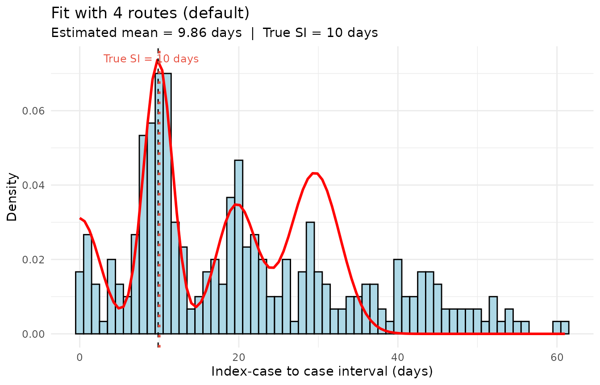

The fourth route looks overestimated, which is because all the ICC
intervals whose values are greater than $4\mu$ are assigned by the
algorithm to the fourth route. This increases the fourth route weight.

The compare_n_routes used below shows how setting the number of routes
helps the algorithm capture the distribution.

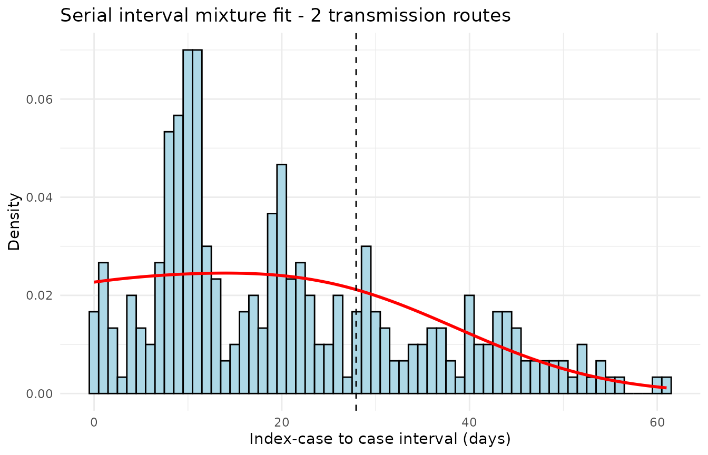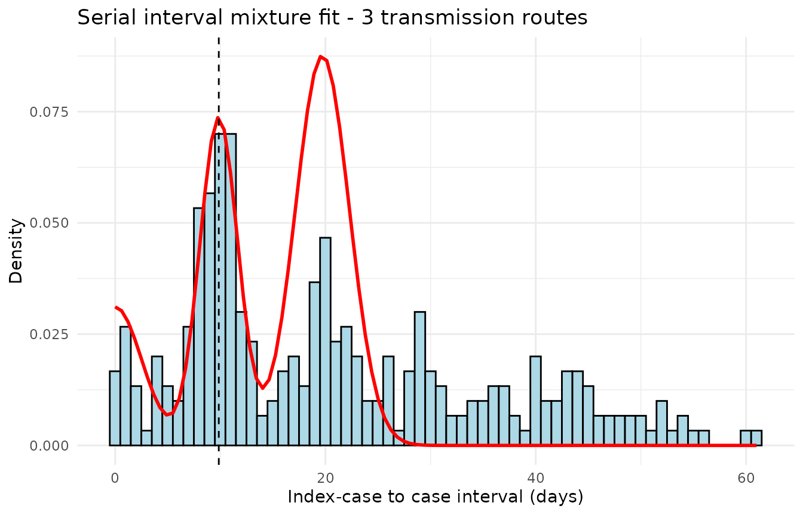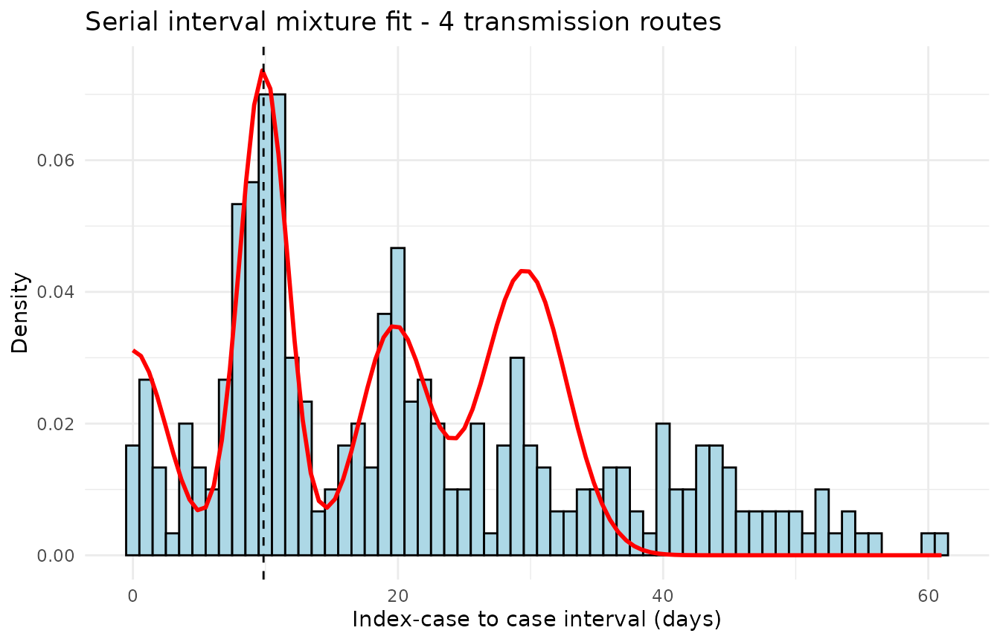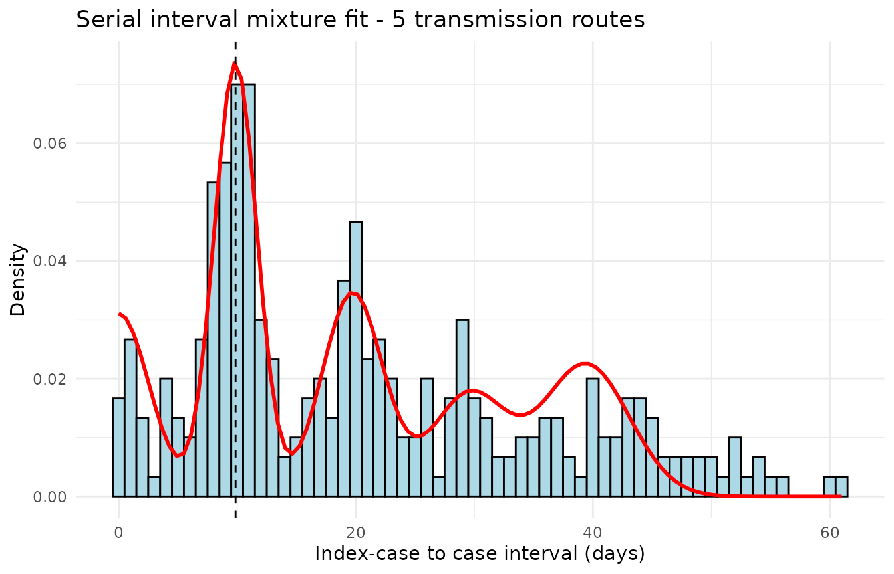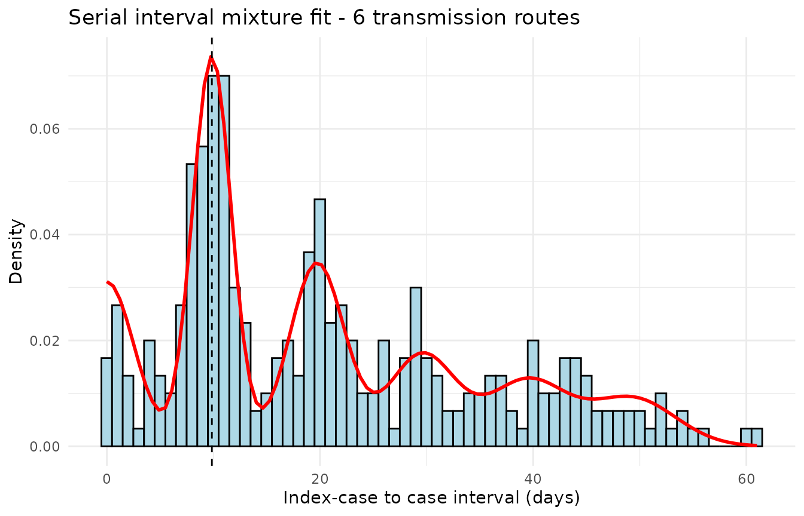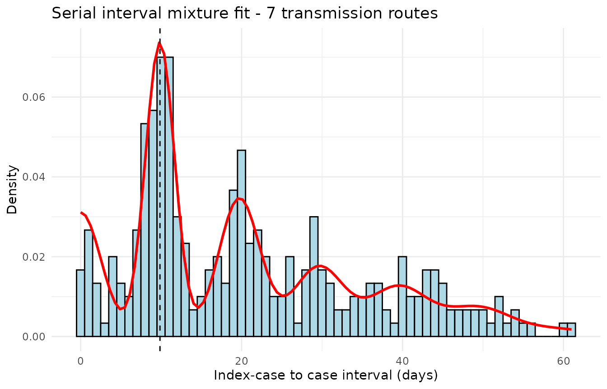

    #> === Comparison of the n_routes ===
    #>   n_routes     mu  sigma loglik  aic  bic n_params converged iterations
    #> 1        2 27.920 14.372  -1195 2398 2412        4      TRUE         17
    #> 2        3  9.856  1.816  -4043 8098 8121        6      TRUE         43
    #> 3        4  9.856  1.816  -1782 3580 3610        8      TRUE         32
    #> 4        5  9.856  1.816  -1227 2474 2511       10      TRUE         31
    #> 5        6  9.856  1.816  -1147 2318 2363       12      TRUE         31
    #> 6        7  9.856  1.816  -1147 2321 2373       14      TRUE         30
    #> 
    #> Best n_routes according to BIC : 6 
    #> Best n_routes according to AIC : 6

These graphs show how increasing the number of routes has splitted all
ICC intervals in the right component they belong to.

### Example 2 — Highly symptomatic disease (simulated data)

We now simulate a disease where almost all cases are symptomatic: long
routes (PT, PQ) are very rare.

    #> True SI mean : 20 days
    #> N observations : 300
    #> ICC range : 0 to 30 days

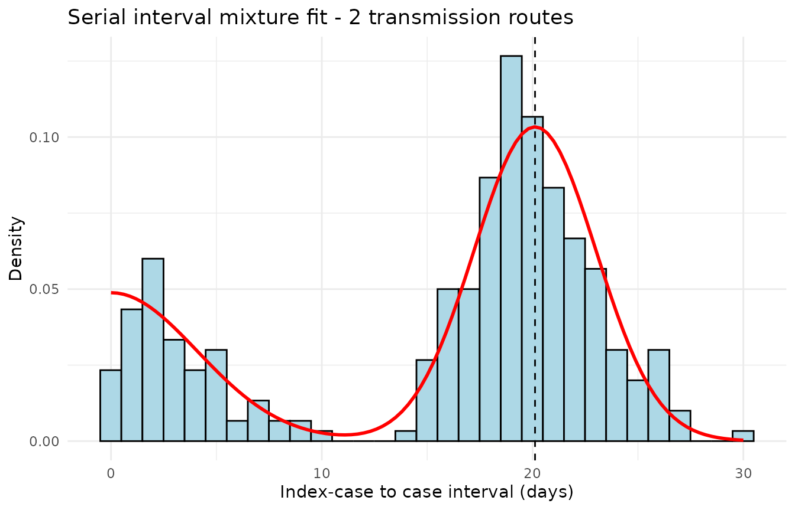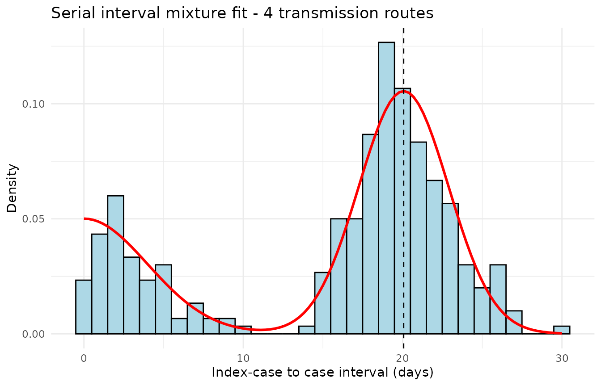

    #> === Comparison of the n_routes ===
    #>   n_routes    mu sigma loglik  aic  bic n_params converged iterations
    #> 1        2 20.12 2.893 -883.8 1776 1790        4      TRUE          6
    #> 2        3 20.07 2.820 -884.9 1782 1804        6      TRUE          7
    #> 3        4 20.07 2.820 -884.9 1786 1815        8      TRUE          7
    #> 
    #> Best n_routes according to BIC : 2 
    #> Best n_routes according to AIC : 2

The example above shows us that the initial algorithm is robust to the
case where the number of routes set in the algorithm is greater that the
number of actual routes. Then, the algorithm will find weights close to
0.

### Example 3 — Example with real outbreak data - Influenza in Canada

We now run the simulation using real outbreak data and compare the
results from 4 to 8 routes.

The example below uses the data from outbreak of Influenza A(H1N1)pdm09
in the study from Savage, in 2011 in Canada.

    #> === 4 routes ===
    #> Estimated mean : 2.84 days
    #> Estimated sd   : 0.76 days
    #> Converged      : TRUE
    #> Component weights:
    #> [1] 0.238 0.444 0.000 0.180 0.000 0.139 0.000


In the original version of the algorithm, the ICC intervals whose values
are greater than $4\mu$ are captured by the fourth route.

With the new version of the algorithm, those last value are well
captured by the 8 routes : the weight for the fourth route has
decreased, and the ICC intervals are splitted in the route they belong
to.

    #> === 8 routes ===
    #> Estimated mean : 2.84 days
    #> Estimated sd   : 0.76 days
    #> Converged      : TRUE
    #> Component weights:
    #>  [1] 0.238 0.444 0.000 0.179 0.000 0.060 0.000 0.010 0.000 0.022 0.000 0.027
    #> [13] 0.000 0.019 0.000


### Example 4 — Example with real outbreak data - Pertussis in Netherlands

Using the dataset from a pertussis outbreak in Netherlands, from
Greeff’s study in 2010, the last values are not captured by the first
algorithm.

    #> === 4 routes ===
    #> Estimated mean : 22.8 days
    #> Estimated sd   : 6.49 days
    #> Converged      : TRUE
    #> Component weights:
    #> [1] 0.275 0.406 0.000 0.209 0.000 0.109 0.000


With the new version of the algorithm, those last value are captured
better by the 8 routes.

    #> === 8 routes ===
    #> Estimated mean : 22.8 days
    #> Estimated sd   : 6.49 days
    #> Converged      : TRUE
    #> Component weights:
    #>  [1] 0.275 0.406 0.000 0.208 0.000 0.066 0.000 0.024 0.000 0.013 0.000 0.005
    #> [13] 0.000 0.003 0.000


------------------------------------------------------------------------

## Conclusion and practical recommendations

### Summary

This vignette has presented the extension brought to the
[`si_estim()`](https://kylieainslie.github.io/mitey/reference/si_estim.md)
function of the `mitey` package, which now allows the user to freely
specify the number of transmission routes $n_{\text{routes}}$ and an
uncertainty window of the recorded dates.

The key takeaways are:

- The number of routes is a **modelling choice** that should be guided
  by the biology of the disease.
- Using **too few routes** for a highly asymptomatic disease leads to
  overestimation of the SI.
- Using **too many routes** for a highly symptomatic disease introduces
  unnecessary parameters and can destabilise the EM algorithm.
- The
  [`compare_n_routes()`](https://kylieainslie.github.io/mitey/reference/compare_n_routes.md)
  function automates the comparison and allows the optimal model to be
  selected objectively.

### Recommended workflow

``` r
# Step 1: get a ballpark for the number of routes using the heuristics
n1 <- n_optimal1(icc_data)
n2 <- n_optimal2(icc_data)


cat("Heuristics:", n1, n2, "\n")
n_max_explore <- max(n1, n2) + 2   # safety margin

# Step 2: compare models from 2 to n_max_explore routes
comparison <- compare_n_routes(
  dat          = icc_data,
  n_routes_max = n_max_explore,
  dist         = "normal"
)

# Step 3: estimate with the BIC-optimal number of routes
n_opt <- comparison$n_routes[which.min(comparison$bic)]
result_final <- si_estim(icc_data, dist = "normal", n_routes = n_opt)

# Step 4: visualise the final fit
plot_si_fit_result(result_final, dat = icc_data, dist = "normal")
```

------------------------------------------------------------------------

## References

Vink, Margaretha Annelie, Martinus Christoffel Jozef Bootsma, and Jacco
Wallinga. 2014. “Serial Intervals of Respiratory Infectious Diseases: A
Systematic Review and Analysis.” *Am. J. Epidemiol.* 180 (9): 865–75.

------------------------------------------------------------------------

*This document was generated with
`rmarkdownr packageVersion("rmarkdown")` and
`miteyr packageVersion("mitey")`.*
