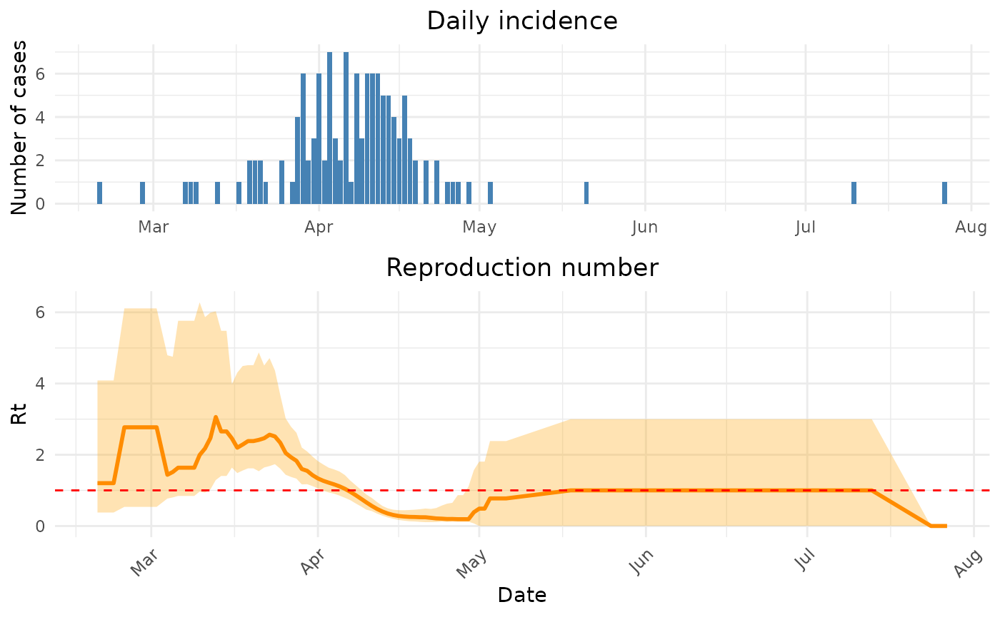
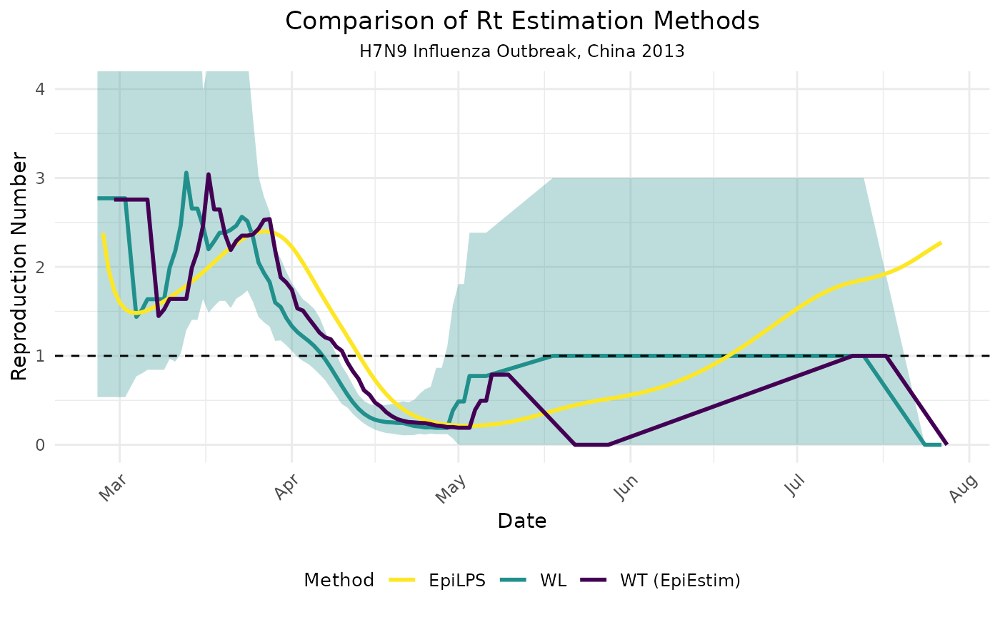

# Estimation of time-varying reproduction number

## Introduction

The `mitey` package is a lightweight package designed to provide easy
implementation of the methods used in [Ainslie et
al. 2024](https://kylieainslie.github.io/mitey/articles/epidemiology_of_scabies.html)
to estimate epidemiological characteristics of scabies transmission.
However, these methods are more widely applicable than in the context of
scabies. One of the key functionalities of `mitey` is the estimation of
the time-varying case reproduction number using data on time of symptom
onset. The case reproduction number ($R_{t}^{c}$) is defined as the
average number of new infections that an individual who becomes
infected, or symptomatic, at a particular time point will go on to
cause¹, and is useful in retrospective analyses. The method of Wallinga
and Lipsitch estimates the time-varying case reproduction number by
determining the likelihood of an event occurring for every pair of time
points². The method requires no assumptions beyond the specification of
the serial interval distribution, making it straightforward and easy to
implement.

In this article, we will demonstrate how to use `mitey` to estimate
$R_{t}^{c}$ using a synthetic data set and real data. We will also
compare the estimates from `mitey` to estimates from other R packages
that can be used for similar analyses, namely `EpiEstim`³ and `EpiLPS`⁴.

### Mathematical Background

The Wallinga-Lipsitch method estimates the case reproduction number
based on the idea that the relative likelihood that case j infected case
i depends on their time difference, weighted by the serial interval
distribution.

For a given case i that showed symptoms at time t_i, the probability
that it was infected by case j (with symptom onset at time t_j) is:

$$p_{i,j} = \frac{w\left( t_{i} - t_{j} \right)}{\sum\limits_{k}w\left( t_{i} - t_{k} \right)}$$

Where: - $w(\tau)$ is the probability mass function of the serial
interval for a delay of $\tau$ - The denominator sums over all potential
infectors $k$

The reproduction number for cases with symptom onset at time $t_{j}$ is
then:

$$R\left( t_{j} \right) = \frac{\sum\limits_{i}I_{i} \cdot p_{i,j}}{I_{j}}$$

Where $I_{i}$ and $I_{j}$ are the number of cases at times $t_{i}$ and
$t_{j}$, respectively.

### Function Documentation

#### `wallinga_lipsitch()`

##### Description

Estimates the time-varying reproduction number using the
Wallinga-Lipsitch method, which calculates the case reproduction number
based on symptom onset data and serial interval distribution.

##### Usage

``` r
wallinga_lipsitch(
  incidence,
  dates,
  si_mean,
  si_sd,
  si_dist = "gamma",
  smoothing = 0,
  bootstrap = FALSE,
  n_bootstrap = 1000,
  conf_level = 0.95,
  shift = FALSE
)
```

##### Arguments

- incidence: Numeric vector of daily case counts.
- dates: Vector of dates corresponding to the incidence data.
- si_mean: Mean of the serial interval distribution.
- si_sd: Standard deviation of the serial interval distribution.
- si_dist: Distribution to use for serial interval (“gamma” or
  “normal”).
- smoothing: Window size for smoothing estimates (0 for no smoothing).
- bootstrap: Logical; whether to compute bootstrap confidence intervals.
- n_bootstrap: Number of bootstrap samples to generate.
- conf_level: Confidence level for intervals (0.95 = 95% CI).
- shift: Logical; whether to shift estimates by one mean serial
  interval.

##### Returns

A data frame with columns:

- date: Original dates from input
- incidence: Daily case counts
- R: Estimated case reproduction number
- R_corrected: Case reproduction number with right-truncation correction

If bootstrap=TRUE:

- R_lower, R_upper: Confidence intervals for R
- R_corrected_lower, R_corrected_upper: Confidence intervals for
  R_corrected

If shift=TRUE:

- shifted_date: Dates shifted forward by one mean serial interval

### Smoothing

The `smoothing` argument allows users to smooth Rt estimates. The
argument takes an integer value that indicates the window of time over
which to smooth the estimates. If `smoothing=0`, no smoothing will be
performed. Below is description of how the smoothing is performed.

1.  Initialization:

    - The function takes the original Rt estimates (r_estimate) and
      window size (window)
    - It creates an output vector of the same length, initially filled
      with NA values
    - It calculates the half-window size for centering purposes

2.  Moving Window Calculation: For each position in the time series, the
    function:

    - Determines window boundaries, adjusting for the start and end of
      the series
    - Extracts values within the window
    - Filters out any missing (NA) or infinite values
    - Calculates the mean of remaining values

3.  Example: For a time series with window size 3:

    - At position 2, it averages positions 1, 2, and 3
    - At the first position, it averages positions 1 and 2 only
    - At positions with missing values, it uses only available data
      points

### Right-Truncation Correction

The Wallinga-Lipsitch method includes a correction for right-truncation,
which addresses the bias in reproduction number estimates near the end
of the time series. This bias occurs because some secondary cases
infected by recent primary cases have not yet been observed due to the
delay represented by the serial interval.

#### Implementation

1.  For each case with symptom onset at time t, we calculate how many
    days have passed between t and the end of the observation period.
2.  Using the serial interval distribution, we calculate the probability
    that a secondary infection from this case would have been observed
    by the end of our observation period.
3.  We then adjust the reproduction number estimate by dividing by this
    probability, giving more weight to recent cases that have had less
    time to generate observable secondary cases.

This correction becomes increasingly important for cases near the end of
the time series, but can introduce additional variance. Therefore,
estimates from the most recent days should still be interpreted with
caution.

## Synthetic data

First, we will generate a synthetic time series of incidence data using
the function
[`generate_synthetic_epidemic()`](https://kylieainslie.github.io/mitey/reference/generate_synthetic_epidemic.md)
which uses a renewal equation to generate the case incidence data. The
renewal equation used is:
$$\lambda_{t} = \sum\limits_{i = 1}^{t - 1}R_{i} \times I_{i} \times w(t - i)$$

Where: - $\lambda_{t}$ = expected new cases on day $t$ - $R_{i}$ =
reproduction number on day $i$ - $I_{i}$ = observed cases on day $i$ -
$w(t - i)$ = probability mass of serial interval for delay $(t - i)$.

Before we generate the synthetic data we need to specify the true
time-varying reproduction numbers and the parameters of the serial
interval distribution (mean and standard deviation).

``` r

# Set seed for reproducibility
set.seed(123)

# True Rt values
true_r_values <- c(
  rep(1.5, 20),                            # Start with R=1.5
  rep(2.0, 20),                            # Increase to R=2.0
  rep(0.8, 20),                            # Decrease to R=0.8
  rep(1.2, 20)                             # Increase to R=1.2
)

# Set serial interval parameters
si_mean <- 5
si_sd <- 2
si_dist <- "gamma"

# Generate synthetic data with high initial cases for stability
synthetic_data <- generate_synthetic_epidemic(
  true_r = true_r_values,
  si_mean = si_mean,
  si_sd = si_sd,
  si_dist = si_dist,
  initial_cases = 500
)
```

    #>         date true_r incidence
    #> 1 2023-01-01    1.5       500
    #> 2 2023-01-02    1.5         3
    #> 3 2023-01-03    1.5        56
    #> 4 2023-01-04    1.5       137
    #> 5 2023-01-05    1.5       145
    #> 6 2023-01-06    1.5       179


### Estimating the case reproduction number

Next, using the simulated incidence data, we can estimate the
time-varying case reproduction number using the method developed by
Wallinga and Lipsitch².

``` r
results <- wallinga_lipsitch(
  incidence = synthetic_data$incidence,
  dates = synthetic_data$date,
  si_mean = si_mean,
  si_sd = si_sd,
  si_dist = "gamma",
  smoothing = 0,
  bootstrap = TRUE,
  n_bootstrap = 1000,
  conf_level = 0.95
)
```

    #>         date incidence        R R_corrected  R_lower  R_upper R_corrected_lower
    #> 1 2023-01-01       500 1.513819    1.513819 1.400246 1.640943          1.400246
    #> 2 2023-01-02         3 1.507403    1.507403 1.402781 1.620427          1.402781
    #> 3 2023-01-03        56 1.510453    1.510453 1.409458 1.624172          1.409458
    #> 4 2023-01-04       137 1.502045    1.502045 1.410784 1.606036          1.410784
    #> 5 2023-01-05       145 1.478686    1.478686 1.394027 1.575553          1.394027
    #> 6 2023-01-06       179 1.474034    1.474034 1.391377 1.566991          1.391377
    #>   R_corrected_upper
    #> 1          1.640943
    #> 2          1.620427
    #> 3          1.624172
    #> 4          1.606036
    #> 5          1.575553
    #> 6          1.566991

Now, we can compare the estimated $R_{t}^{c}$ values to the true $R_{t}$
that we specified. However, an important thing to note is that the
“true” $R_{t}$ is the instantaneous reproduction number. We are
estimating the case reproduction number, and therefore, our estimates
should be shifted to the left by one serial interval. When we shift the
estimates by a serial interval (blue dashed line), we see that our
estimates are in agreement with the true $R_{t}$.


### Sensitivity to Serial Interval Parameters

The estimates produced by the Wallinga-Lipsitch method are sensitive to
the specified serial interval distribution. Let’s explore how changes in
the mean and standard deviation affect our estimates for the synthetic
epidemic:


### Comparing methods

Using the `estimRmcmc` function within the `EpiLPS` package, we can
compare our estimates to those produced my `EpiLPS` and `EpiEstim` (by
specifying `Cori = TRUE`) for estimating the instantaneous reproduction
number. We can also estimate the case reproduction number using the
method of Wallinga and Teunis^(**wallinga2004?**) as estimated by
`EpiEstim` (by specifying `WTR = TRUE`).

``` r
si_spec <- Idist(mean = si_mean, sd = si_sd, dist = si_dist)

fitmcmc <- estimRmcmc(incidence = synthetic_data$incidence, si = si_spec$pvec,
                      CoriR = TRUE, WTR = TRUE,
                      niter = 5000, burnin = 2000)
```

``` r
summary(fitmcmc)
#> Estimation of the reproduction number with Laplacian-P-splines 
#> -------------------------------------------------------------- 
#> Total number of days:          80 
#> Routine time (seconds):        16.529 
#> Method:                        MCMC (with Langevin diffusion) 
#> Hyperparam. optim method:      Nelder-Mead 
#> Hyperparam. optim convergence: TRUE 
#> Mean reproduction number:      1.370 
#> Min  reproduction number:      0.791 
#> Max  reproduction number:      2.028 
#> --------------------------------------------------------------
```


## Real-world case studies

### 1. Zika outbreak in Giradot, Colombia (2015)

To illustrate how to apply
[`wallinga_lipsitch()`](https://kylieainslie.github.io/mitey/reference/wallinga_lipsitch.md)
to real data and compare it to other methods, we’ll use data on daily
incidence of the Zika virus disease in Giradot, Colombia from October
2015 to January 2016. The data is available from the `outbreaks` package
and is called `zika2015`.

``` r
lapply(zika2015, head, 10)
#> $incidence
#>  [1] 1 2 1 4 2 5 2 4 5 4
#> 
#> $dates
#>  [1] "2015-10-19" "2015-10-22" "2015-10-23" "2015-10-24" "2015-10-25"
#>  [6] "2015-10-26" "2015-10-27" "2015-10-28" "2015-10-29" "2015-10-30"
#> 
#> $si
#>  [1] 7.771909e-09 2.813233e-05 2.333550e-03 3.004073e-02 1.241007e-01
#>  [6] 2.372892e-01 2.605994e-01 1.887516e-01 9.898834e-02 4.014149e-02
```

``` r
zika_epicurve <- epicurve(zika2015$incidence, dates = zika2015$date, datelab = "14d")
zika_epicurve
```


Now we’ll estimate the case reproduction number using
[`wallinga_lipsitch()`](https://kylieainslie.github.io/mitey/reference/wallinga_lipsitch.md).

``` r
res_zika <- wallinga_lipsitch(
  incidence = zika2015$incidence,
  dates = zika2015$date,
  si_mean = 7,
  si_sd = 1.5,
  si_dist = "gamma",
  smoothing = 0,
  bootstrap = TRUE,
  n_bootstrap = 1000,
  conf_level = 0.95,
  shift = TRUE
)
```


#### Compare with EpiLPS and EpiEstim

Below we compare the estimates using the Walling and Lipsitch method
(WL) with those of `EpiLPS` and the Wallinga and Teunis method (WT)
produced by `EpiEstim`. We see similar results and see the expected shif
in the estimates of EpiLPS because it is estimating the instantaneous
reproduction number. Additionally, it is important to note that the
below WL estimates have not been smoothed.

``` r
si <- Idist(mean = 7, sd = 1.5)
epifit <- estimR(zika2015$incidence, dates = zika2015$dates, si = si$pvec, WTR = TRUE)
```


### 2. Influenza A (H7N9) Outbreak in China (2013)

Again, we’ll use a dataset from the `outbreaks` package. For this
analysis, we’ll use data from the 2013 influenza A (H7N9) outbreak in
China.

``` r
data(fluH7N9_china_2013)
str(fluH7N9_china_2013)
#> 'data.frame':    136 obs. of  8 variables:
#>  $ case_id                : Factor w/ 136 levels "1","2","3","4",..: 1 2 3 4 5 6 7 8 9 10 ...
#>  $ date_of_onset          : Date, format: "2013-02-19" "2013-02-27" ...
#>  $ date_of_hospitalisation: Date, format: NA "2013-03-03" ...
#>  $ date_of_outcome        : Date, format: "2013-03-04" "2013-03-10" ...
#>  $ outcome                : Factor w/ 2 levels "Death","Recover": 1 1 1 NA 2 1 1 1 NA 1 ...
#>  $ gender                 : Factor w/ 2 levels "f","m": 2 2 1 1 1 1 2 2 2 2 ...
#>  $ age                    : Factor w/ 61 levels "?","15","2","21",..: 58 7 11 18 20 9 54 14 39 20 ...
#>  $ province               : Factor w/ 13 levels "Anhui","Beijing",..: 11 11 1 8 8 8 8 13 13 11 ...
```

The dataset contains details about 136 confirmed cases of H7N9 influenza
in China between February and May 2013.


The H7N9 influenza outbreak shows a clear epidemic pattern, with most
cases occurring between March and April 2013. Based on the literature,
the serial interval for influenza A (H7N9) has been estimated to be
around 7-9 days.

Let’s now estimate the time-varying reproduction number using the
Wallinga-Lipsitch method:

``` r
# Estimate Rt using the Wallinga-Lipsitch method
# For H7N9, we'll use serial interval estimates from the literature
# Mean: 8.1 days, SD: 3.4 days (based on Cowling et al., 2013)

h7n9_rt <- wallinga_lipsitch(
  incidence = h7n9_complete$cases,
  dates = h7n9_complete$date_onset,
  si_mean = 8.1,
  si_sd = 3.4,
  si_dist = "gamma",
  smoothing = 7,  # Apply 7-day smoothing for weekly patterns
  bootstrap = TRUE,
  n_bootstrap = 500,
  conf_level = 0.95,
  shift = TRUE
)
```



To provide a comprehensive methodological comparison, let’s compare our
Wallinga-Lipsitch implementation with the `EpiLPS` and `EpiEstim`
packages, similar to our Zika analysis:



The comparison reveals several interesting methodological insights when
applied to the H7N9 outbreak:

1.  **Timing differences**: The Wallinga-Lipsitch (WL) method and
    Wallinga-Teunis (WT) method from EpiEstim produce roughly similar
    temporal patterns, but with some timing differences. This is
    expected as they both estimate the case reproduction number but use
    slightly different mathematical approaches.

2.  **EpiLPS vs. WL/WT**: The EpiLPS method, which estimates the
    instantaneous reproduction number, shows a different pattern,
    particularly in terms of when changes in transmission are detected.
    This is consistent with the theoretical differences between
    instantaneous and case reproduction numbers.

3.  **Uncertainty handling**: Note that our WL method includes
    confidence intervals (shown as the blue shaded region), providing
    important context about estimation uncertainty that should be
    considered when interpreting results.

## References

1\.

Gostic, K. M. *et al.* Practical considerations for measuring the
effective reproductive number, rt. *PLoS Comput. Biol.* **16**, e1008409
(2020).

2\.

Wallinga, J. & Lipsitch, M. How generation intervals shape the
relationship between growth rates and reproductive numbers. *Proc. Biol.
Sci.* **274**, 599–604 (2007).

3\.

Cori, A., Ferguson, N. M., Fraser, C. & Cauchemez, S. A new framework
and software to estimate time-varying reproduction numbers during
epidemics. *Am. J. Epidemiol.* **178**, 1505–1512 (2013).

4\.

Gressani, O., Wallinga, J., Althaus, C. L., Hens, N. & Faes, C. EpiLPS:
A fast and flexible bayesian tool for estimation of the time-varying
reproduction number. *PLoS Comput. Biol.* **18**, e1010618 (2022).
