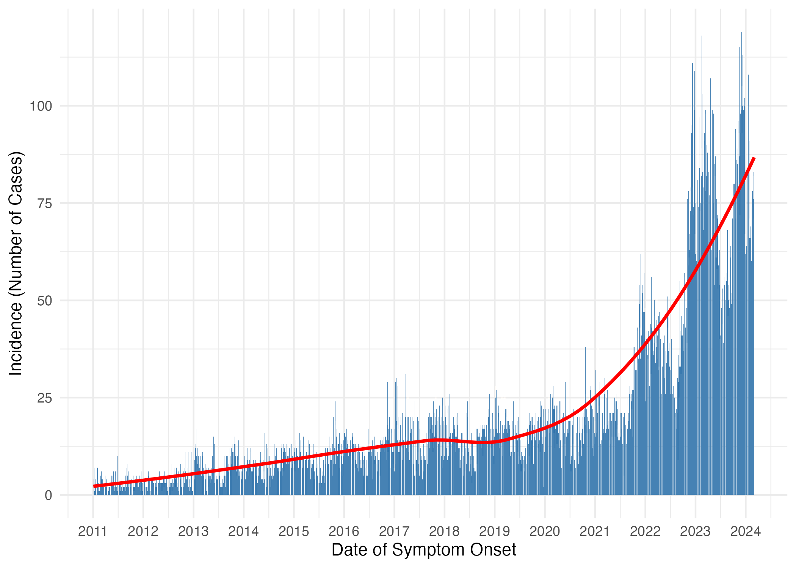
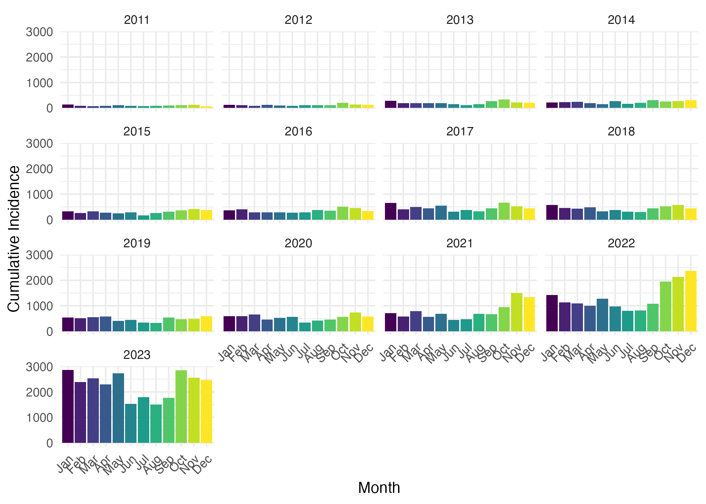

```{r, include = FALSE}
knitr::opts_chunk$set(
  collapse = TRUE,
  comment = "#>",
  fig.width=7, 
  fig.height=4
)

options(rmarkdown.html_vignette.check_title = FALSE)
```

```{r setup, echo=FALSE, include = FALSE, results='hide'}
library(bookdown)
library(flextable)
library(ftExtra)
library(openxlsx)
library(tidyverse)
library(broom)
library(viridis)
library(cowplot)
library(brms)
library(officer)
library(tidybayes)
library(ggridges)
library(glue)
library(zoo)
library(stringr)
library(forcats)
library(Hmisc)
library(ISOweek)
library(devtools)
load_all()
```

**Affiliations**

1. Centre for Infectious Disease Control, National Institute for Public Health and the Environment (RIVM), Bilthoven, the Netherlands

2. School of Public Health, University of Hong Kong, Hong Kong SAR, China

3. Nivel, Utrecht, the Netherlands

4. Department of Biomedical Data Sciences, Leiden University Medical Center, Leiden, the Netherlands

**This manuscript has not been peer-reviewed.**

# Abstract
**Introduction:** Scabies is a contagious skin disease caused by the infestation of the skin by the Sarcopes scabiei mite, causing an itchy rash. Scabies affects over 400 million people annually worldwide, and a rise in scabies cases has been observed in recent years throughout Western Europe. Despite the large number of people infected with scabies annually, some fundamental epidemiological characteristics of scabies infections have not been described. 

**Methods:** In this work we use publicly available data on date of symptom onset during scabies outbreaks to determine the mean serial interval, time between symptom onset in an infector and symptom onset in an infectee, of scabies infection. We also use weekly numbers of persons consulting for scabies in primary care from sentinel surveillance in the Netherlands from 2011-2023 to determine quantities related to the spread of scabies over time, namely, the time-varying reproduction number, growth rate, and basic reproduction number.

**Results:** We found that there was considerable heterogeneity in estimates of the serial interval from different data sources, with mean serial interval estimates ranging from 98.4 days to 167.3 days. We estimated a pooled mean serial interval of 123.24 days (95% credible interval: 91.44, 153.41 days). An analysis of annual incidence of scabies per 1000 people in the Netherlands resulted in an estimated annual growth rate of 0.25 cases per 1000 people per year. Using the estimated growth rate and mean and standard deviation of the serial interval distribution we estimated the basic reproduction number, $R_0 = 1.09$. When looking at scabies incidence over may years in the Netherlands, we saw yearly waves of infections, with the amplitude of incidence gradually increasing over time. We estimated the time-varying reproduction number by time of diagnosis and found that $R_t$ peaked for cases diagnosed in August.

**Discussion:** This study offers new insights into scabies transmission dynamics and suggests that additional interventions with limited efficacy that could prevent 8% of secondary infections would suffice to bring the reproduction number to below one. This may be achieved by increasing public awareness and targeted measures. These strategies may be effective in similar European settings. Our findings also underscore the need for precise data on scabies transmission, which could improve model accuracy for control strategies. Future research should focus on detailed characterization of scabies' natural history to enhance intervention modeling and better inform containment efforts.


# Introduction

Scabies is classified as a neglected tropical disease caused by infestation of the skin with a microscopic mite (Sarcoptes scabiei) [@who2024]. Symptoms are characterized by itchiness and rash at the site of infestation. Scabies affects around 400 million people per year, and accounts for a large proportion of skin disease in many low- and middle-income countries [@who2024], particularly in tropical regions such as Asia, South America, and Oceania [@karimkhani2017]. Historically, scabies infections were a common affliction in Europe in the late 1800s and early 1900s with incidence peaking in 1918 and 1945 [@savin2005; @christophersen1978]. After the end of World War II, scabies incidence in Europe fell and remained low for decades [@savin2005; @christophersen1978; @downs1999]. However, a rise in scabies cases has been observed through out Europe in recent years [@deursen2022; @reichert2021; @redondo-bravo2021; @lugovic-mihic2020; @amato2019; @dona2023], which may increase the burden on healthcare systems due to scabies if the rising trend continues.

The global disease burden of scabies, expressed in disability-adjusted life years (DALY), is low compared to other infectious diseases. A 2017 study found that scabies was responsible for only 0.21% of DALYs from all conditions studied worldwide [@karimkhani2017]. However, areas with high scabies prevalence have been shown to have high disease burden of scabies partially due to secondary infections which can lead to severe outcomes [@karimkhani2017]. Additionally, there is no simple diagnostic self-test for scabies, so diagnosis relies on clinical assessment [@cox2021], which can increase the workload of general practitioners (GPs) during periods of high scabies incidence. Furthermore, individuals infected with scabies can suffer from stigma, discrimination and distress [@cox2021; @white2001] in addition to the physical manifestations of the disease, making them less likely to seek medical care and further promoting transmission [@mitja2017]. Research has also shown that scabies can have economic implications for both the patients and the healthcare system due to ineffective and long duration of treatment [@cox2021].

Despite the considerable burden scabies poses, little is known about the dynamics of scabies transmission, such as the generation time (time between infection of an index case and a secondary case), serial interval (the time from onset of symptoms in an index case to the time of symptom onset in a secondary case), growth rate, and reproduction number (the average number of secondary cases resulting from one index case). A series of studies in the 1940s by Kenneth Mellanby and colleagues [@mellanby1944; @mellanby1972] form much of the basis of our current understanding of scabies transmission. Some important results from the experiments performed in the 1940s by Mellanby and colleagues include an estimation of the incubation period, or time to symptom onset, of 4-6 weeks for first infections and 24 hours for subsequent infections; the parasite rate, defined as the number of mature female mites per person, over time, which was shown to increase rapidly, peak around 100 days after infection, and then decline quickly; and the probability of transmission via a secondary object (e.g., bed sheets) is low and most transmission occurs from person-to-person contact [@mellanby1944]. However, these studies were performed using healthy volunteers, so may not be representative of scabies transmission dynamics in other populations.

In this work, we aim to estimate key epidemiological characteristics of scabies, such as the serial interval, growth rate, and reproduction number, to better describe scabies transmission dynamics. Specifically, we use time series of reported symptom onset dates of scabies outbreaks from the literature to estimate the mean serial interval of scabies. We also use data on the number of scabies diagnoses each week in the Netherlands to estimate time-varying reproduction number and annual growth rate. To our knowledge, this is the first study to estimate these quantities for scabies, and can provide critical information for the design of appropriate infection control policy.  

<!-- Some modelling work has been performed to study the
potential impacts of intervention strategies, such as mass drug
administration, on scabies transmission [@kinyanjui2018; @lydeamore2019;
@tellioglu2023]; however, the values used to parameterise these models
are based largely on Mellanby's 1944 study [@mellanby1944] and use information about the mite life-cycle to approximate the time scales of scabies infection cycles.
For example, Kinyanjui et al. [@kinyanjui2018] assume a latent period of 7-14 days to allow for the time for the time it takes for a fertilised female mite to reproduce and incorporate it into a susceptible-exposed-infectious model of scabies transmission. However, this assumes an equal chance of
infectiousness despite the number of mites inhabiting an infested
individual. Mellanby [@mellanby1944] shows that the probability of onward
transmission of scabies is rare when the number of mites on an
individual is low and increases as the mite population grows. A better
approximation of the disease process can be obtained using the
generation time or serial interval; however, no such estimates exist for
scabies. 

Additionally, the growth rate and reproduction number are quantities
that describe how fast an infectious disease spreads. They are also used
to determine appropriate control measures to reduce the number of
secondary infections so that an epidemic dies out. However, in the case
of scabies, the basic reproduction number, the average number of
secondary infections resulting from one index case in a completely
susceptible population, has never been described. This makes it
immensely difficult to determine what level of control measures are
needed to contain disease spread. As evidence continues to suggest that
scabies is a growing problem in European countries and remains a large
problem elsewhere, it is important to describe the epidemiological
characteristics of scabies so that the required control efforts to curb
scabies epidemics can be determined. -->

# Methods

## Data Sources
To estimate the mean serial interval for scabies infections, we conducted a rapid literature search to identify papers with publicly available data on date of symptom onset for scabies outbreaks. We searched Google images using the terms "scabies" and "epidemic curve" to find papers that featured symptom onset data over time and found 8 papers. Papers were excluded if data on date of symptom onset was not available or we were not able to reconstruct the date of symptom onset time series from the paper. We further excluded studies whose data did not span a sufficiently long time window for secondary infections to occur. We defined "sufficiently long" as 100 days based on the average peak parasite rate described by Mellanby [@mellanby1944]. After excluding papers that did not meet our criteria, we included a total of 4 papers in our analysis. 

In addition to publicly available data on date of scabies symptom onset, we used high resolution data on the number of diagnoses of scabies over time in the Netherlands [@hooiveld2017] to estimate the time-varying reproduction number and growth rate. Briefly, we used published numbers of weekly numbers of persons consulting for scabies (per 100,000 population) from 2011 to 2023 as diagnosed by general practitioners (GPs). Scabies is recorded by ICPC code S72 [@lamberts1987]. These are collected real-time in the nationally representative Nivel Primary Care Database (Nivel-PCD) of electronic health records from GPs, hosted by Nivel, the Netherlands institute for health services research [@hasselaar]. Scabies is not a notifiable disease in the Netherlands, thus information on trends in incidence of scabies cases can only be obtained from GP diagnoses and dispensation of scabicides. Individuals in institutions (e.g., care homes, prisons) usually have their own health care provider and are generally not taken into account in GP registrations.

## Serial Interval

Using the dates of symptom onset for scabies cases from four different
studies [@ariza2013; @kaburi2019; @tjon-kon-fat2021; @akunzirwe2023] of scabies outbreaks (Table 1<!--\@ref(tab:si_results_tab)-->), we estimated the mean and standard deviation of the serial interval
distribution using the method proposed by Vink et al. [@vink2014]. The
method involves calculating the index case-to-case (ICC) interval for
each person, where the person with the greatest value for number of days since symptom onset will be considered the index case. The rest of the individuals will have an ICC interval calculated as the number of days between their symptom onset and the index case. We assumed that serial interval distributions for scabies can be approximated by a normal (Gaussian) distribution. Since serial intervals can be negative, albeit with low probability, the use of a distribution on a continuous scale is appropriate. The Gamma distribution has a more flexible shape, but as it is only defined for positive values of the serial interval it can only be used when the probability of negative values is very low. We performed a sensitivity analysis in which we assume the serial intervals for scabies can be approximated by a Gamma distribution (see Appendix).

```{r, si_analysis, echo=FALSE}
# read in data
si_data <- readRDS("data/si_data.rds")

# use method from Vink et al. to estimate SI for each study
# assume a normal distribution, then do some wrangling
result_norm <- si_data %>%
  select(icc_interval, study) %>%
  group_by(study) %>%
  summarise(result = list(si_estim(icc_interval))) %>%
  mutate(
    mean = map_dbl(result, "mean"),
    sd = map_dbl(result, "sd"),
    wts = map(result, "wts")  # Store wts as a list-column
  ) %>%
  select(-result) %>%
  unnest(wts) %>% # Unnest the wts column if needed %>%
  pivot_longer(
    cols = c(mean, sd, wts),
    names_to = "statistic",
    values_to = "value"
  ) %>%
  group_by(study, statistic) %>%
  mutate(
    occurrence = row_number(),
    statistic = if_else(statistic == "wts", paste0("weight_", occurrence), statistic)
  ) %>%
  filter(statistic != "mean" | occurrence == 1) %>%
  filter(statistic != "sd" | occurrence == 1) %>%
  select(-occurrence) %>%
  ungroup()

# Reshape results from long to wide format
result_norm_wide <- result_norm %>%
  pivot_wider(
    names_from = statistic,
    values_from = value
  )

```

We used the `brms` package in R [@burkner2017] to estimate the pooled mean serial interval. We used a
Bayesian hierarchical random-effects model in which we assume that there is a typical distribution for serial intervals, from which an outbreak-specific mean serial interval is sampled [@harrer]. We specified the prior distribution for the pooled mean as a normal distribution with a mean of 100 days, based on Mellanby’s reports on parasite rate and a standard deviation of 50 days to make sure the prior is not very informative. We used a Cauchy(0,1) distribution for the between-study heterogeneity. We performed sensitivity analyses on our choices of prior distributions (see Appendix).

```{r, meta_analysis, echo=FALSE, message=FALSE, results='hide', warning=FALSE}
# merge si_data and result_norm_wide for plotting
df_merged <- si_data %>%
  select(study, icc_interval) %>%
  left_join(result_norm_wide, by = "study", relationship = "many-to-many")

# Perform a Bayesian meta-analysis
df_ma <- df_merged %>%
  group_by(study) %>%
  mutate(n = n()) %>%
  slice(1) %>%
  ungroup() %>%
  mutate(se = sd/sqrt(n)) %>%
  select(study, n, mean, sd, se) %>%
  # don't include Larrosa and DPBH because their study periods are too short
  filter(study %in% c("Akunzirwe et al.",
                      "Ariza et al.",
                      "Kaburi et al.",
                      "Tjon-Kon-Fat et al"))

# we will perform a Bayesian meta-analysis using the {brms} package
# specify priors
priors <- c(prior(normal(100,50), class = Intercept),
            prior(cauchy(0,1), class = sd))

# fit a random effects model
# Fit the random effects model with adjusted control parameters
m.brm <- brm(
  mean | se(se) ~ 1 + (1 | study),
  data = df_ma,
  prior = priors,
  iter = 8000,  # Increased number of iterations
  warmup = 4000,  # Increased warmup
  control = list(adapt_delta = 0.999, max_treedepth = 20)  # Increased adapt_delta and max_treedepth
)
```

## Growth Rate and Basic Reproduction Number ($R_0$)

We estimated the annual growth rate of scabies cases by fitting a generalized linear model (GLM) with a log link and a quasipoisson family to the annual cumulative incidence of scabies diagnoses per 1000 people from 2011 to 2023 in the Netherlands [@nivel]. This approach accounts for the overdispersion commonly observed in count data and allows for non-integer values in the data. The GLM with a log link assumes an exponential growth model, where the logarithm of the expected count of scabies cases is linearly related to time and assumes quasipoisson distributed errors. <!--, which adjusts for the variance proportional to the mean. -->

Using the fitted quasipoisson model, we determined the projected incidence of scabies per 1000 people until 2033, assuming no interventions are implemented and that the growth rate remains constant. We calculated 95% prediction intervals for the predicted incidence using standard error values adjusted to takes into account the dispersion parameter derived from the model, ensuring that our estimates appropriately reflect the uncertainty in the predictions.

Using the estimated annual growth rate, we can estimate the basic reproduction number as $R_0 = \exp(r*T – (1/2) r^2 s^2)$, where $r$ is the annual growth rate, $T$ is the mean generation time (in years), and $s^2$ is the variance of the generation time distribution [@wallinga2007]. We assume that nearly everyone exposed has not been previously infected.

<!-- We estimated the annual growth rate of scabies cases by fitting an
exponential growth model to annual number of scabies diagnoses per 1000 people
from 2011 to 2023 in the Netherlands [@nivel]. We assumed normally
distributed errors, with mean zero and constant variance. Using the
fitted exponential growth model and the estimated growth rate, we then
determined the projected incidence of scabies per 1000 people until 2033
if no interventions are implemented and the growth rate remains
constant. We used bootstrapping with 1000 samples to obtain 95%
confidence bounds for the projected incidence of scabies per 1000
people. -->

```{r, growth_rate_code, echo = FALSE, message=FALSE, warning=FALSE, results='hide'}

# read in data set
file_path <- "../inst/extdata/data/scabies_data_incidence_yearly.xlsx"
scabies_inc_total <- read.xlsx(file_path, sheet = "total") 

scabies_inc_total <- scabies_inc_total %>%
  rename(inc = `Inc.per.1.000`) %>%
  mutate(cases = as.numeric(inc),
         time = Year) %>%
  select("time", "cases")

scabies_inc_total <- scabies_inc_total %>%
  filter(!is.na(cases) & !is.infinite(cases) & !is.na(time) & !is.infinite(time))

# Define the exponential growth model
# exponential_model <- function(x, a, b) {
#   a * exp(b * x)
# }

### get starting values
# Center the time variable around its mean for numerical stability
# scabies_inc_total <- scabies_inc_total %>%
#   mutate(time_centered = time - mean(time))
# 
# # Log-transform the cases for linear regression
# log_cases <- log(scabies_inc_total$cases)
# 
# # Perform linear regression on log-transformed data
# lm_fit <- lm(log_cases ~ time_centered, data = scabies_inc_total)
# 
# # Extract initial values from linear regression
# a_init <- exp(coef(lm_fit)[1])
# b_init <- coef(lm_fit)[2]

### Fitting the model with initial values
# Fit an exponential model with Poisson errors
poisson_model <- glm(cases ~ time, 
                     family = quasipoisson(link = "log"), 
                     data = scabies_inc_total)

# Calculate 95% confidence intervals
ci_coeff <- confint(poisson_model)

# Predict future values
future_time <- seq(max(scabies_inc_total$time) + 1, 
                   max(scabies_inc_total$time) + 10, by = 1)

predicted_model <- predict(poisson_model, 
                            newdata = data.frame(time = future_time), 
                            type = "response", 
                            se.fit = TRUE)

# Extract predicted values and standard errors
predicted_values <- predicted_model$fit
standard_errors <- predicted_model$se.fit

# Calculate the dispersion parameter (phi) from the model
phi <- summary(poisson_model)$dispersion

# Calculate the lower and upper confidence intervals
alpha <- 0.05
z_value <- qnorm(1 - alpha / 2)  # Z-value for 95% CI

# Calculate confidence intervals using the dispersion parameter
lower_ci <- predicted_values * exp(-z_value * standard_errors * sqrt(phi) / predicted_values)
upper_ci <- predicted_values * exp(z_value * standard_errors * sqrt(phi) / predicted_values)

# Create a data frame to hold the results
results <- data.frame(
  time = future_time,
  cases = predicted_values,
  lower = lower_ci,
  upper = upper_ci
)

# Combine original and extrapolated data for plotting
scabies_plot_df <- bind_rows(
  scabies_inc_total %>% 
    mutate(type = "Original Data", lower = NA, upper = NA),
  results %>% 
    mutate(type = "Extrapolated Data")
)
row.names(scabies_plot_df) <- NULL
```

## Time-varying Reproduction Number

To estimate time-varying case reproduction number, we first randomly assigned each scabies consultation a date of diagnosis in the week in which the consulation is reported. Since scabies is very hard to diagnose prior to symptom onset [@mellanby1972], and diagnosed cases are captured as part of sentinel surveillance based on GP diagnosis [@nivel], we use the date of diagnosis rather than the date of symptom onset. Using the constructed daily time series of date of diagnosis, we applied the method proposed by Wallinga and Lipsitch [@wallinga2007] to estimate the time-varying daily case reproduction number. The case reproduction number is defined as the average number of new infections that an individual who becomes diagnosed at a particular time point will go on to cause [@gostic2020], and is useful in retrospective analyses such as the one presented here. The method of Wallinga and Lipsitch estimates the time-varying case reproduction number by determining the likelihood of an event occurring for every pair of time points [@wallinga2007]. The method requires the specification of the serial interval distribution. We assumed a normal serial interval distribution with mean 123.24 days and standard deviation 31.55 days, as estimated previously. Due to unobserved onward cases at the end of the time series, we adjusted for right truncation [@cauchemez2006a; @cauchemez2006b]. To obtain 95% confidence intervals on the daily case reproduction number, we generated 100 bootstrapped samples by resampling each case with replacement and reconstructing the incidence time series for each bootstrapped sample. Reproduction number estimates were then smoothed using a rolling average of 6 weeks. 

Because we are using the serial interval distribution as an approximation of the generation interval, which is strictly positive, we performed a sensitivity analysis in which we assumed the serial interval distribution is Gamma distributed with the same mean and variance.

All analyses were performed in R 4.4.0 [@R-base]. Additional R packages used in this work are cited in the Appendix.

# Results

## Serial Interval

We estimated the mean and standard deviation of the serial interval using the epidemic curves from each study assuming an underlying Normal distribution (Table 1<!--\@ref(tab:si_results_tab) -->). There was considerable variation in the estimates of mean serial interval between studies. The shortest estimated mean serial interval (98.4 days) was estimated from data from Ariza et al. [@ariza2013] describing an outbreak of scabies in a kindergarten in Germany. The largest estimated mean serial interval (167.34 days) was estimated from data from Kaburi et al. [@kaburi2019] from an outbreak in a preschool in Ghana. Using data from an outbreak of scabies in a care home in the Netherlands [@tjon-kon-fat2021] we obtained an estimated mean serial interval of 110.7 days. Finally, we obtained an estimated mean serial interval of 122.9 days from data from an outbreak of scabies in a fishing community in the Hoima District of Uganda [@akunzirwe2023]. We assessed the fitted derial interval distribution visually by plotting the estimated densities over the epidemic curves (Figure 1).

We performed a sensitivity analysis in which we estimated the mean and standard deviation of the serial interval assuming an underlying Gamma distribution (Table S1<!-- \@ref(tab:tab_si_gam --> and Figure S1<!--\@ref(fig:gam_si_plots) -->). We found that we obtained similar mean estimates as compared to assuming an underlying Normal distribution (albeit lower for most studies), but the estimated standard deviations were larger. Model fit was assessed visually by plotting the estimated densities over the epidemic curves (Figure S1<!--\@ref(fig:gam_si_plots) -->) and we found that the Gamma distribution was a poorer fit of the data as compared to the normal distribution.

```{r si_results_tab, echo=FALSE, tab.cap="Table 1. Estimated mean and standard deviation (SD) of serial interval distribution, in days, for each study."}
df_si <- result_norm_wide %>%
  select(study, mean, sd) %>%
  filter(study %in% c("Akunzirwe et al.", "Ariza et al.", "Kaburi et al.", 
                      "Tjon-Kon-Fat et al")) %>%
  mutate(mean = round(mean, 2),
         sd = round(sd, 2))

ft_si <- flextable(df_si) %>%
  set_header_labels(
    study = "Study", 
    mean = "Mean", 
    sd = "Standard Deviation"
  ) %>%
  autofit(add_w = 0.2) %>%
  bold(part = "header") %>%
  border_remove() %>%
  border(i = 1, border.top = officer::fp_border(width = 1), part = "header") %>%
  border(i = 1, border.bottom = officer::fp_border(width = 1), part = "header") %>%
  border(i = nrow(df_si), border.bottom = officer::fp_border(width = 1), part = "body") 

ft_si
```

```{r si_dist_plot, echo=FALSE, eval=TRUE, fig.cap="Figure 1. Epidemic curves and estimated serial interval distributions from four scabies outbreaks. Red line indicates estimated serial interval density assuming an underlying normal distribution.", fig.id=TRUE}
#knitr::include_graphics("figures/epidemic_curve_density_plot.png")
# merge si_data and result_norm_wide for plotting
df_merged <- si_data %>%
  select(study, icc_interval) %>%
  left_join(result_norm_wide, by = "study", relationship = "many-to-many")

# Apply the plot_si_fit function by study
plots <- df_merged %>%
  group_by(study) %>%
  group_map(~ plot_si_fit(
    dat = .x$icc_interval,
    mean = .x$mean[1],
    sd = .x$sd[1],
    weights = c(.x$weight_1[1], .x$weight_2[1] + .x$weight_3[1],
                .x$weight_4[1] + .x$weight_5[1], .x$weight_6[1] + .x$weight_7[1]),
    dist = "normal"
  ))

# Annotate plots with study names and labels
# Find the order of the groups
group_order <- df_merged %>%
  group_by(study) %>%
  group_keys()

labeled_plots <- lapply(seq_along(plots), function(i) {
  plots[[i]] +
    ggtitle(group_order[i,1]) +            # Add study names as titles
    theme(plot.title = element_text(hjust = 0.5))  # Center the title
})

# Combine plots into a multi-pane figure
final_plot <- plot_grid(
  plotlist = labeled_plots[-c(3,5)], # exclude DPBH and Larrosa
  labels = "AUTO",      # Automatically adds labels (A, B, C, etc.)
  label_size = 14,      # Size of the labels
  ncol = 2              # Number of columns; adjust as needed
)

# Display the final combined plot
print(final_plot)
```

To obtain a pooled estimate of mean serial interval, we analysed the data as in a Bayesian meta-analysis with random intercepts for each study. <!--We excluded studies with study periods less than 100 days as it was unlikely to observe a primary-secondary infection in that time.--> We estimated a pooled mean serial interval of 123.24 days (95% credible
interval: 91.44, 153.41 days) (Figure 2<!--\@ref(fig:forest_plot-->). As we saw with the individual study estimates (Table 1<!--\@ref(tab:si_results_tab)-->), the analysis provided further evidence of substantial heterogeneity among studies due to a large value of the standard deviation of the random intercepts (31.55 days). The large variation in the mean serial interval estimates can be visualised by plotting the estimated distributions of each study's serial interval shown in Figure 2<!--\@ref(forest_plot)-->). A normal distribution is assumed, and is parameterized by the estimated mean and standard deviation of serial interval for each study.

```{r forest_plot, echo = FALSE, eval = TRUE, fig.cap="Figure 2. Forest plot of estimated mean serial intervals and pooled mean.", warning=FALSE, message=FALSE}
# Create forest plot with posteriors

# get posterior draws from each study
study.draws <- spread_draws(m.brm, r_study[study,], b_Intercept) %>%
  mutate(b_Intercept = r_study + b_Intercept)

# get pooled posterior draws
pooled.effect.draws <- spread_draws(m.brm, b_Intercept) %>%
  mutate(study = "Pooled Effect")

# combine posterior draws from each study and pooled
forest.data <- bind_rows(study.draws,
                         pooled.effect.draws) %>%
  ungroup() %>%
  mutate(study = str_replace_all(study, "[.]", " ")) %>%
  mutate(study = reorder(study, b_Intercept))

# calculate mean and credible intervals
forest.data.summary <- group_by(forest.data, study) %>%
  mean_qi(b_Intercept)

# plot
forest_plot <- ggplot(aes(b_Intercept,
           relevel(study, "Pooled Effect",
                   after = Inf)),
       data = forest.data) +

  # Add vertical lines for pooled effect and CI
  geom_vline(xintercept = fixef(m.brm)[1, 1],
             color = "grey", linewidth = 1) +
  geom_vline(xintercept = fixef(m.brm)[1, 3:4],
             color = "grey", linetype = 2) +
  #geom_vline(xintercept = 0, color = "black",
  #           size = 1) +

  # Add densities
  geom_density_ridges(fill = "blue",
                      rel_min_height = 0.01,
                      col = NA, scale = 1,
                      alpha = 0.8) +

  geom_pointinterval(aes(y = study,
                         x = b_Intercept,
                         xmin = .lower,
                         xmax = .upper),
                     data = forest.data.summary,
                     size = 1,
                     orientation = "horizontal") +

  # Add text and labels
  # geom_text(data = mutate_if(forest.data.summary,
  #                            is.numeric, round, 2),
  #           aes(label = glue("{b_Intercept} [{.lower}, {.upper}]"),
  #               x = Inf), hjust = "inward") +
  labs(x = "Mean Serial Interval (days)", # summary measure
       y = element_blank()) +
  theme_minimal() +
  theme(
    panel.grid.major = element_blank(),   # Remove major grid lines
    panel.grid.minor = element_blank(),   # Remove minor grid lines
    axis.line = element_line(color = "black", linewidth = 0.5), # Add axis lines
    axis.ticks = element_line(color = "black"), # Add axis ticks
    axis.title = element_text(size = 12, face = "bold"), # Customize axis titles
    axis.text = element_text(size = 10) # Customize axis text
    )

print(forest_plot)

```

## Growth Rate and Basic Reproduction Number ($R_0$)

```{r calculate_R0, echo = FALSE}
# Extract the estimated time coefficient (r)
r <- coef(poisson_model)["time"]  # Replace with your actual coefficient name if different

# Set the values for T and s
T_ <- 123.24/365.25
s <- 31.55/365.25

# Calculate R0
R0 <- exp(r * T_ - (1/2) * r^2 * s^2)

# Calculate the lower and upper confidence intervals for the expression
lower_r <- ci_coeff["time", 1]  # Lower CI for r
upper_r <- ci_coeff["time", 2]  # Upper CI for r

# Calculate the lower confidence interval for the expression
lower_ci_R0 <- exp(lower_r * T_ - (1/2) * lower_r^2 * s^2)

# Calculate the upper confidence interval for the expression
upper_ci_R0 <- exp(upper_r * T_ - (1/2) * upper_r^2 * s^2)
```

We estimated the annual growth rate of scabies cases by fitting an exponential growth model to annual incidence of scabies per 1000 people from 2011 to 2023 in the Netherlands [@deursen2022]. We estimated an annual growth rate of `r round(r, 2)` (95% CI: `r round(lower_r, 2)`, `r round(upper_r, 2)`) <!-- 0.353 (95% CI: 0.152, 0.452) -->. Using the previously estimated pooled mean serial interval (123.24 days or 0.34 years) and standard deviation of the serial interval (31.55 days or 0.09 years) as a proxy for the generation time, we estimated the basic reproduction number $R_0 =$ `r round(R0, 2)` (95% CI: `r round(lower_ci_R0, 2)`, `r round(upper_ci_R0, 2)`) <!--$R_0=1.13$-->. Using the fitted exponential growth model and the estimated growth rate, we then determined the projected annual incidence of scabies per 1000 people until 2033 if no interventions are implemented. We found that there could be a substantial increase in scabies incidence in the next 10 years in the Netherlands if no measures are taken to mitigate scabies spread (Figure 3<!--\@ref(fig:growth_rate_fig)-->). 

```{r growth_rate_fig, echo=FALSE, message = FALSE, warning = FALSE, fig.align='center', fig.cap="Figure 3. Annual scabies incidence per 1000 people from 2011 to 2023 (points) and then projected scabies indcidence per 1000 people for 2024 to 2033 (line) using an exponential growth model with annual growth rate of 0.25 (95% CI: 0.20, 0.30) cases per 1000 people. Shaded regions represent 95% prediction intervals for projected scabies incidence. The y-axis is displayed on the log-scale and represents the natural log of scabies incidence per 1000 people.", out.width="100%"}

# read in df for plot
#scabies_plot_df <- readRDS("data/scabies_gr_proj_df.rds")

# Define the custom palette
custom_palette <- c("#21908C", "#440154") # Custom colors

# Plot with custom palette and specified line and point styles
ggplot(
  data = scabies_plot_df, 
  aes(x = time, y = log(cases), color = type, fill = type)) +
  # Points with no line through them
  geom_point(
    data = filter(scabies_plot_df, type == "Original Data"), 
    aes(y = log(cases)), size = 2, shape = 16) +
  # Line with points for other types
  geom_line(
    data = filter(scabies_plot_df, type == "Extrapolated Data"), 
    aes(y = log(cases)), linewidth = 1.2) +
  geom_point(
    data = filter(scabies_plot_df, type == "Extrapolated Data"), 
    aes(y = log(cases)), size = 2, shape = 16) +

  # Ribbon for the confidence interval
  geom_ribbon(
    aes(ymin = log(lower), ymax = log(upper), fill = type), 
    alpha = 0.2, color = NA) +

  # Labels and theme
  labs(x = "Year", y = "Annual incidence of scabies per 1000 people (log scale)",
       color = "Data Type", fill = "Data Type") +
  scale_color_manual(values = custom_palette) +
  scale_fill_manual(values = custom_palette) +
  theme_minimal() +
  theme(legend.position = "right",
        axis.text.y = element_text(size = 8))

```

## Time-varying Reproduction Number

To determine the pattern of scabies spread over time, particularly if the incidence of scabies infections displays a repeating temporal pattern (e.g., seasonal waves), we first plotted weekly incidence of scabies infections per 1000 people in The Netherlands from 2011 to 2023 (Figure 4<!-- \@ref(fig:epidemic_curve)-->). We observed approximate yearly peaks and troughs of incidence. Incidence was typically highest in October or November (however, in 2022, highest incidence occurred in December). There were additional rises in incidence in March-May (Figure S2) in most years. Cumulative incidence was typically lowest in the summer months June/July before rising again in August. We also observed that the amplitude of peak incidence gradually increasing over time. There were marked increases in peak incidence in 2022, 2023, and the beginning of 2024 (Figure 4<!--\@ref(fig:epidemic_curve)-->). The observed patterns in scabies incidence indicate that there are approximately three generations of infections per year (Figure S2). For example, in 2023, one generation gets diagnosed in October, the next generation gets diagnosed in January the third generation gets diagnosed in May. 

```{r epidemic_curve, echo=FALSE, message=FALSE, warning=FALSE, fig.cap="Figure 4. Number of scabies consultations per week per 100,000 people in the Netherlands by date of consultation.", out.width="100%"}

# read in consultations data 
nivel_wkly_data <-
  read.xlsx("../inst/extdata/data/scabies_data_consultations_weekly.xlsx") %>%
  # fix/translate variable names
  rename(diagnosis_code = `Diagnose.(ICPC)`,
         year = `ISO-jaar`,
         week_num = `ISO-weeknr.(ma-zo)`,
         pop_size = `Aantal.populatie`,
         cases = `Aantal.prevalente.cases`,
         prev_per_100000 = `Prevalentie.per.100.000`) %>%
  # drop diagnosis var
  select(-diagnosis_code) %>%
  # create new var that combines year and week
  mutate(yr_wk = paste(year, week_num, sep = "_"),
         year = as.factor(year))

nivel_daily_data <- nivel_wkly_data %>%
  uncount(cases) %>% # Repeat rows based on the number of cases
  mutate(
    iso_week = paste0(year, "-W", sprintf("%02d", as.numeric(week_num))),
    first_day = ISOweek2date(paste0(iso_week, "-1")),
    random_day = sample(0:6, n(), replace = TRUE),
    onset_date = first_day + days(random_day)
  ) %>%
  select(-iso_week, -first_day, -random_day)

# Group data by onset_date and calculate the daily incidence
df <- nivel_daily_data %>%
  group_by(onset_date) %>%
  mutate(count = n()) %>%
  distinct(onset_date, count) %>%
  arrange(onset_date) %>%
  mutate(num_date = as.numeric(onset_date)) %>%
  ungroup() %>%
  rename(inc = count) %>%
  select(onset_date, inc)

ggplot(df, aes(x = onset_date, y = inc)) +
  geom_col(fill = "steelblue") +
  #geom_smooth(method = "loess", color = "red", se = FALSE) +
  scale_x_date(date_breaks = "1 year", date_labels = "%Y") +
  labs(
    x = "Date of Consultation",
    y = "Number of scabies consultations per 100,000 people"
  ) +
  theme_minimal()
# epidemic_curve
# 
```

Next, we estimated the time-varying case reproduction number of weekly scabies diagnoses (Figure 5<!--\@ref(fig:rt_plot)-->). As with weekly incidence, we see temporal waves of transmission, with $R_t$ peaking in August. The time difference in peak incidence (October-January, Figure S2) versus peak reproduction number (June-September) can be explained by the long serial interval of scabies (123 days with a 31-day standard deviation). Therefore, infections generated by diagnosed cases in October-January are likely to manifest several months later, due to the long serial interval.

We performed a sensitivity analysis in which we estimated the time-varying reproduction number assuming an underlying gamma distribution for the serial interval with the same mean and standard deviation. We obtained similar estimates of $R_t$ as when we assumed the underlying serial interval distribution was a Normal distribution (Figure S3).

```{r rt_plot, echo=FALSE, message=FALSE, warning=FALSE, fig.cap="Figure 5. Time-varying reproduction number of scabies transmission. Colored bands denote season. Winter = December 1 – February 28 (or 29 on leap year); Spring = March 1 – May 31; Summer = June 1 – August 31; Autumn = September 1 – November 31. Shaded region represents the 95% confidence envelope.", out.width="100%"}

# read in data
rt_df_for_plot <- readRDS("data/rt_df_for_plot.rds")

# plot rt_adjusted with confidence bounds (and season bars)
# Breaks for background rectangles
start_breaks <- c(as.Date("2011-01-01"),
                  seq(as.Date("2011-03-01"), 
                      tail(rt_df_for_plot$onset_date, 1), by = "quarter"))
end_breaks <- c(start_breaks[-1] - 1, tail(rt_df_for_plot$onset_date,1))
rects <- data.frame(xstart = start_breaks,
                    xend = end_breaks,
                    season = factor(c(rep(c("winter", "spring", "summer", "autumn"),
                                          length.out = length(start_breaks))),
                                    levels = c("winter", "spring", "summer", "autumn")))
roll_days <- 42 # number of days to calculate rolling average over

p <- ggplot() +
  geom_rect(data = rects, aes(xmin = xstart, xmax = xend, ymin = -Inf, ymax = Inf,
                              fill = season), alpha = 0.4) +
  scale_fill_viridis_d() +
  geom_line(data = rt_df_for_plot, aes(x = onset_date,
                                       y = rollmean(rt_adjusted, roll_days, fill = NA))) +
  geom_ribbon(data = rt_df_for_plot, aes(x = onset_date,
                                         ymin = rollmean(lower_rt_adjusted, roll_days, fill = NA),
                                         ymax = rollmean(upper_rt_adjusted, roll_days, fill = NA)),
              alpha = 0.3) +
  geom_hline(yintercept = 1, linetype = "dashed", color = "black", linewidth = 0.6) +
  geom_hline(yintercept = 1.1, linetype = "dashed", color = "grey", linewidth = 0.6) +
  scale_x_date(date_breaks = "1 year", date_labels = "%Y") +
  labs(x = "Date", y = "Reproduction Number") +
  theme(
    panel.background = element_blank()
  )

p
```

# Discussion

In this work, we aimed to characterize scabies transmission dynamics by estimating key epidemiological parameters namely, the mean and standard deviation of the serial interval distribution, the basic reproduction number, the annual growth rate, and the time-varying reproduction number. Here, we provide some of the first estimates of the serial interval of scabies infection. We used symptom onset data from four previously published studies of scabies outbreaks and found that estimates of mean serial interval ranged from 98 days to 167 days. The large range in serial interval may be due to difference is study setting (school, nursing home, general population), contact patterns within those settings, and data quality. We performed a meta-analysis and obtained a pooled estimate of mean serial interval of 123 days. This estimate is of the same order of magnitude as the duration to reach peak scabies parasite rate (100 days since infection) plus the incubation period (28-42 days) described by Mellanby [@mellanby1944]. However, this estimate should be used with caution. It was estimated by pooling data from studies in different populations, geographical locations, and settings, and using data on time of symptom onset. For more precise estimates of mean serial interval, future studies should collect information on transmission pairs.

We observed seasonality in scabies transmission, finding that scabies incidence was highest in the Octber and November, while the time-varying reproduction number peaked in the August. This pattern may be due to the long serial interval of scabies (123 days), whereby, the delayed onset of secondary cases shifts the peak in $R_t$ several months after the peak in incidence. The seasonal pattern in scabies incidence has been documented in other European countries [@korycinska2020; @reichert2021; @redondo-bravo2021; @lugovic-mihic2020; @amato2019; @dona2023] as well as the Western Pacific [@ducrot2022] and has been explained by increased indoor contact during colder months [@mimouni2003]. The seasonal pattern in scabies transmission can also be partially explained by the school calendar. Since scabies transmission has been shown to be driven by adolescents and young adults [@reichert2021; @deursen2022], seasonal epidemics can be seeded at the start of the school year and peak in winter before reaching a trough in late spring and summer when the school year ends. Conversely, peak transmission could occur in summer when people are wearing less clothing; therefore, making skin-to-skin contact more probable, but cases are not detected until much later in the fall or winter.

Interestingly, in contrast to almost all notifiable infectious diseases, we found that the numbers of scabies cases increased during the COVID-19 pandemic (relative to years prior to the pandemic). Other infectious diseases, such as non-SARS-CoV-2 respiratory viruses, saw decreased incidence during the COVID-19 pandemic due to effective control measures [@chow2023] or underreporting and underdiagnosis [@deursen2022]. The increase in scabies infections during the COVID-19 pandemic has also been observed in other countries, such as Ireland [@griffin2022], Spain [@martinez-pallas2020], Ethiopia [@asgedom2024], and Turkey [@akaslan2022]. The increases in scabies infestations are likely due to increased indoor contact as a result of COVID-19 lockdowns and other control measures that restricted personal movement, such as curfews [@deursen2022], which often led to people staying overnight. With more time indoors, members of households share space for long periods, which may increase the risk of transmitting the scabies mites through direct contact or by fomites [@griffin2022; @martinez-pallas2020]. 

Our study has several limitations. First, when estimating the serial interval and reproduction number, we assume that each infection is a person's first infection. The time to symptom onset after infection (incubation period) has been described as 4-6 weeks for a person's first infection, but only 24 hours for subsequent infections [@mellanby1944]. If a significant portion of individuals were experiencing a post-primary infection, then the estimated mean serial interval would likely be overestimated. Therefore, our estimates should be considered upper bounds of the average serial interval. 

Second, when estimating the time-varying reproduction number, we used the pooled mean and standard deviation from the meta-analysis across studies of scabies epidemics. These studies varied in setting, geographic location, and study population, and the individual estimates of mean serial interval varied considerably across studies. It is possible that using the pooled mean and standard deviation from the meta-analysis does not represent the true mean serial interval among the Dutch population; however, no other estimates exist.

Third, to estimate the time-varying reproduction number we used data on date of scabies consultations. This data is only a proxy for true disease incidence data as the same person may have a consultation with their GP multiple times for the same infection. This may cause an overestimation of number of infections per week. We also assume that date of symptom onset is consistent with date of consultation (and subsequent scabies diagnosis). Since we do not know the delay between infection and consultation/diagnosis, we cannot precisely pinpoint the time that most transmission events occur. In a study of a scabies epidemic in Germany, the index case was not diagnosed for approximately 3 months following symptom onset [@ariza2013]. This delay in diagnosis can be due to the fact that scabies symptoms are not unique to scabies (itching, rash) or are misdiagnosed at first. While correcting for the delay between symptom onset and diagnosis of scabies cases would improve estimates of the time-varying reproduction number based on time of infection, this information is not routinely collected making correction for this delay difficult. Future studies should focus on trying to gather information about the delay between symptom onset and diagnosis. Additionally, the only estimate of the incubation period for scabies is the range provided by Mellanby of 4-6 weeks [@mellanby1944]. There is no data in the original study or in the literature to support this estimate or provide a point estimate with confidence bounds. Future research should aim to reproduce the original incubation period estimates and obtain more precise information on the incubation period of scabies infection.

Scabies continues to be a problem globally and better understanding of the epidemiological characteristics that govern scabies transmission can help containment efforts. We estimated that, in the Netherlands, $R_0=1.09$, which is just above one. The required control effort to prevent the epidemic from growing is to prevent $(1-1/R_0) * 100\% = 8\%$ of all secondary infections. This reduction in secondary infections can be achieved with additional measures even if these have a low efficacy, such as educating the age groups (adolescents and young adults) in which scabies are most prevalent about the causes and symptoms of scabies infections, requiring a scabies check for university students prior to the school year, or informing GPs about the higher risk of scabies in certain groups to more quickly diagnose patients with symptoms consistent with a scabies infestation. While these strategies may not be effective in all locations where scabies is prevalent, they may help curb scabies infections in other European countries that have similar populations and scabies prevalence to the Netherlands.

In conclusion, this study has provided some of the first estimates of the epidemiological parameters governing scabies transmission. As evidence continues to suggest that scabies is a growing problem in European countries and remains a large problem elsewhere, the estimates provided here can help determine required control efforts to curb scabies epidemics. For example, the estimated epidemiological quantities can be used to parameterize mathematical models of scabies spread to determine the projected impact of different control measures. Prior mathematical modelling of scabies transmission have had to rely on the work of Mellanby [@mellanby1944] for model parameterisation [@kinyanjui2018; @lydeamore2019;
@tellioglu2023]. This work has also highlighted that very little is known about the transmission dynamics of scabies. Future work should focus on obtaining more precise information on the natural history of scabies infections to improve estimates of the underlying quantities that govern scabies spread.

# Data Availability

All code, data, and scripts which reproduce the results of this paper can be found at [https://github.com/kylieainslie/mitey](https://github.com/kylieainslie/mitey).

# Funding Statement
The study was financed by the Netherlands Ministry of Health, Welfare and Sport. 
<!-- include ESCAPE? -->

# References

::: {#refs}
:::

# Appendix

```{r render_to_word, echo=FALSE, eval=FALSE}
# To render Word
rmarkdown::render("vignettes/epidemiology_of_scabies.Rmd", output_format = "word_document")
```

## Sensitivity Analyses

### Serial Interval

We performed a sensitivity analysis on the underlying distribution of serial interval. In the main analysis we assumed the serial interval was normally distributed. In the sensitivity analysis we assumed the serial interval was Gamma distributed. The estimated mean and standard deviation of serial interval for each study is shown in Table S1 <!--\@ref(tab:si_sa)-->. For all studies, except Larrosa et al., the mean is serial interval is lower when estimated assuming an underlying Gamma distribution. When assuming an underlying Gamma distribution, the standard deviations were higher than when assuming an underlying Normal distribution. We see from Figure S1 <!--\@ref(fig:gam_si_plots)--> that the Gamma distribution does not fit the data well. It is possible that the Gamma distribution fits scabies data poorly due to the long incubation period of scabies and the possibility of negative serial intervals.

```{r, si_results_gam, echo=FALSE, eval=TRUE}
# read in data
si_data <- readRDS("data/si_data.rds") %>%
  filter(study %in% c("Kaburi et al.", "Ariza et al.", "Akunzirwe et al.",
                      "Tjon-Kon-Fat et al"))

# assume a gamma distribution
result_gam <- si_data %>%
  select(icc_interval, study) %>%
  group_by(study) %>%
  summarise(result = list(si_estim(icc_interval, dist = "gamma"))) %>%
  mutate(
    mean = map_dbl(result, "mean"),
    sd = map_dbl(result, "sd"),
    wts = map(result, "wts")  # Store wts as a list-column
  ) %>%
  select(-result) %>%
  unnest(wts) %>% # Unnest the wts column if needed %>%
  pivot_longer(
    cols = c(mean, sd, wts),
    names_to = "statistic",
    values_to = "value"
  ) %>%
  group_by(study, statistic) %>%
  mutate(
    occurrence = row_number(),
    statistic = if_else(statistic == "wts", paste0("weight_", occurrence), statistic)
  ) %>%
  filter(statistic != "mean" | occurrence == 1) %>%
  filter(statistic != "sd" | occurrence == 1) %>%
  select(-occurrence) %>%
  ungroup()

# Plot serial interval curves
# Reshape results from long to wide format
result_gam_wide <- result_gam %>%
  pivot_wider(
    names_from = statistic,
    values_from = value
  )
```

```{r make_gam_table, echo=FALSE}
si_tab_sa <- left_join(result_norm_wide[,c(1:3)], result_gam_wide[,c(1:3)], by = "study") %>%
  filter(study %in% c("Kaburi et al.", "Ariza et al.", "Akunzirwe et al.",
                      "Tjon-Kon-Fat et al"))

tab_si_gam <- flextable(si_tab_sa) %>%
  add_header_row(values = c("Study", "Normal", "Gamma"), colwidths = c(1,2,2)) %>%
  set_header_labels(study = "", mean.x = "Mean", sd.x = "SD", mean.y = "Mean", sd.y = "SD") %>%
  autofit(add_w = 0.2) %>%
  bold(part = "header") %>%
  border_remove() %>%
  border(i = 1, border.top = officer::fp_border(width = 1), part = "header") %>%
  border(i = 1, border.bottom = officer::fp_border(width = 1), part = "header") %>%
  border(i = dim(result_gam_wide)[1], border.bottom = officer::fp_border(width = 1), part = "body") %>%
  add_footer_lines("SD = standard deviation")

set_caption(tab_si_gam, 
  caption = "Table S1. Estimated mean and standard deviation of serial interval from different studies assuming a Normal distribution or Gamma distribution.", 
  style = "Table Caption", 
  autonum = run_autonum(seq_id = "tab", bkm = "tab_si_sa"))
```

```{r, gam_si_plots, echo=FALSE, warning=FALSE, message=FALSE, fig.align='center', fig.cap="Figure S1. Epidemic curves and estimated serial interval distributions from four scabies outbreaks. Red line indicates estimated serial interval density assuming an underlying gamma distribution.", fig.id=TRUE}
# merge si_data and result_norm_wide for plotting
df_merged_gam <- si_data %>%
  select(study, icc_interval) %>%
  left_join(result_gam_wide, by = "study", relationship = "many-to-many")

# Apply the plot_si_fit function by study
plots_gam <- df_merged_gam %>%
  group_by(study) %>%
  group_map(~ plot_si_fit(
    dat = .x$icc_interval,
    mean = .x$mean[1],
    sd = .x$sd[1],
    weights = c(.x$weight_1[1], .x$weight_2[1], .x$weight_4[1]),
    dist = "gamma"
  ))

# Annotate plots with study names and labels
group_order_gam <- df_merged_gam %>%
  group_by(study) %>%
  group_keys()

labeled_plots_gam <- lapply(seq_along(plots_gam), function(i) {
  plots_gam[[i]] +
    ggtitle(group_order_gam[i,1]) +            # Add study names as titles
    theme(plot.title = element_text(hjust = 0.5))  # Center the title
})

# Combine plots into a multi-pane figure
final_plot_gam <- plot_grid(
  plotlist = labeled_plots_gam,
  labels = "AUTO",      # Automatically adds labels (A, B, C, etc.)
  label_size = 14,      # Size of the labels
  ncol = 2              # Number of columns; adjust as needed
)

# Display the final combined plot
print(final_plot_gam)
```

<!-- We also performed a meta-analysis results using Gamma distribution -->

```{r gam_meta_analysis_fig, echo=FALSE, eval=FALSE}
knitr::include_graphics("figures/gam_meta-analysis_forest_plot.png")
```

We performed a sensitivity analysis in which we altered our choice of
prior distribution for mean serial interval. In the main analysis we
assumed a prior distribution of N(100,50). In the sensitivity analysis
we assumed a prior distribution of N(50, 75) and N(150, 50). We obtained similar estimates of the pooled mean serial interval under the alternative prior distributions (Table S2<!--\@ref(tab:prior_sa_tab)-->).

```{r, meta_analysis_sa, echo=FALSE, eval=FALSE, message=FALSE, results='hide', warning=FALSE}

# specify alternative priors
priors2 <- c(prior(normal(50,75), class = Intercept),
            prior(cauchy(0,1), class = sd))

# fit a random effects model
# Fit the random effects model with adjusted control parameters
m.brm2 <- brm(
  mean | se(se) ~ 1 + (1 | study),
  data = df_ma,
  prior = priors2,
  iter = 8000,  # Increased number of iterations
  warmup = 4000,  # Increased warmup
  control = list(adapt_delta = 0.999, max_treedepth = 20)  # Increased adapt_delta and max_treedepth
)

# specify alternative priors
priors3 <- c(prior(normal(150,75), class = Intercept),
            prior(cauchy(0,1), class = sd))

# fit a random effects model
# Fit the random effects model with adjusted control parameters
m.brm3 <- brm(
  mean | se(se) ~ 1 + (1 | study),
  data = df_ma,
  prior = priors3,
  iter = 8000,  # Increased number of iterations
  warmup = 4000,  # Increased warmup
  control = list(adapt_delta = 0.999, max_treedepth = 20)  # Increased adapt_delta and max_treedepth
)

```

```{r, prior_sa_tab, echo=FALSE, tab.cap="Table S2. Estimated pooled mean and standard deviation of serial interval under different prior distributions."}
results_tab <- data.frame(
  Prior = c("N(100, 50)", "N(50, 75)", "N(150, 50)"),
  Mean = c(123.24, 120.87, 127.15),
  SD = c(31.55, 32.22, 31.73)
) %>%
  flextable() %>%
  autofit(add_w = 0.2) %>%
  bold(part = "header") %>%
  border_remove() %>%
  border(i = 1, border.top = officer::fp_border(width = 1), part = "header") %>%
  border(i = 1, border.bottom = officer::fp_border(width = 1), part = "header") %>%
  border(i = 3, border.bottom = officer::fp_border(width = 1), part = "body") 

results_tab
```

### Time-varying Reproduction Number
To see how incidence of scabies varied by month, we plotted the cumulative incidence of scabies cases per 1000 people in the Netherlands by month for each year between 2011 and 2023 (Figure S2).
```{r scabies_cases_by_month, echo = FALSE, fig.cap="Figure S2. Cumulative incidence of scabies cases per 1000 people in the Netherlands by month and year.", out.width='100%'}

```

In the main analysis, when we estimate the time-varying reproduction number, we assume an underlying Normal distriubtion. However, because we are using the serial interval distribution as an approximation of the generation interval, which is strictly positive, we performed a sensitivity analysis in which we assumed the serial interval distribution is Gamma distributed with the same mean and variance (Figure S3).
```{r rt_gamma_sa, echo=FALSE, message=FALSE, warning=FALSE, fig.cap="Figure S3. Time-varying reproduction number of scabies transmission assuming a Gamma distributed serial interval distribution (black line). The time-varying reproduction number estimates assuming an underlying normal serial interval distribution are shown as the blue line. Colored bands denote season. Winter = December 1 – February 28 (or 29 on leap year); Spring = March 1 – May 31; Summer = June 1 – August 31; Autumn = September 1 – November 31.", out.width="100%"}
# read in data
rt_df_for_plot_sa <- readRDS("data/rt_df_for_plot_sa.rds") %>%
  filter(!is.na(rt),
         !is.nan(rt)
         )

# SA plot -------
start_breaks <- c(as.Date("2011-01-01"),
                  seq(as.Date("2011-03-01"), tail(rt_df_for_plot_sa$onset_date, 1), by = "quarter"))
end_breaks <- c(start_breaks[-1] - 1, tail(rt_df_for_plot_sa$onset_date,1))
rects <- data.frame(xstart = start_breaks,
                    xend = end_breaks,
                    season = factor(c(rep(c("winter", "spring", "summer", "autumn"),
                                          length.out = length(start_breaks))),
                                    levels = c("winter", "spring", "summer", "autumn")))

roll_days <- 42

p_sa <- ggplot() +
  geom_rect(data = rects, aes(xmin = xstart, xmax = xend, ymin = -Inf, ymax = Inf,
                              fill = season), alpha = 0.4) +
  scale_fill_viridis_d() +
  geom_line(data = rt_df_for_plot, aes(x = onset_date, y = rollmean(rt_adjusted, roll_days, fill = NA)), 
            color = "blue", linetype = "solid", linewidth = 0.8) +
  geom_line(data = rt_df_for_plot_sa, aes(x = onset_date,
                                       y = rollmean(rt_adjusted, roll_days, fill = NA))) +
  geom_ribbon(data = rt_df_for_plot_sa, aes(x = onset_date,
                                         ymin = rollmean(lower_rt_adjusted, roll_days, fill = NA),
                                         ymax = rollmean(upper_rt_adjusted, roll_days, fill = NA)),
              alpha = 0.3) +
  geom_hline(yintercept = 1, linetype = "dashed", color = "black", linewidth = 0.8) +
  scale_x_date(date_breaks = "1 year", date_labels = "%Y") +
  labs(x = "Date of Symptom Onset", y = "Reproduction Number") +
  coord_cartesian(ylim = c(0, 6)) +
  theme(
    panel.background = element_blank()
  )

p_sa
```

## Computing details

The additional R packages used in this work that have not previously
been mentioned or cited in the main text are `fdrtool`[@fdrtool],
`cowplot`[@cowplot], `devtools`[@devtools], `dplyr`[@dplyr],
`usethis`[@usethis], `ggplot2`[@ggplot2], `flextable` [@flextable],
`ftExtra`[@ftExtra], `openxlsx`[@openxlsx], `tidyverse`[@tidyverse], 
`broom`[@broom], `viridis`[@viridis], `officer`[@officer], 
`tidybayes`[@tidybayes], `ggridges`[@ggridges], `glue`[@glue], `zoo`[@zoo],
`stringr`[@stringr], `forcats`[@forcats], `Hmisc`[@hmisc].

```{r cite_packages, echo=FALSE, eval=FALSE}
r_packages <- c("bookdown","flextable","ftExtra","openxlsx","tidyverse","broom",
                "viridis","cowplot","brms","officer","tidybayes","ggridges",
                "glue","zoo","stringr","forcats","Hmisc","devtools")
lapply(r_packages, citation)
```

## References
::: {#refs}
bibliography: appendix_references.bib
:::
