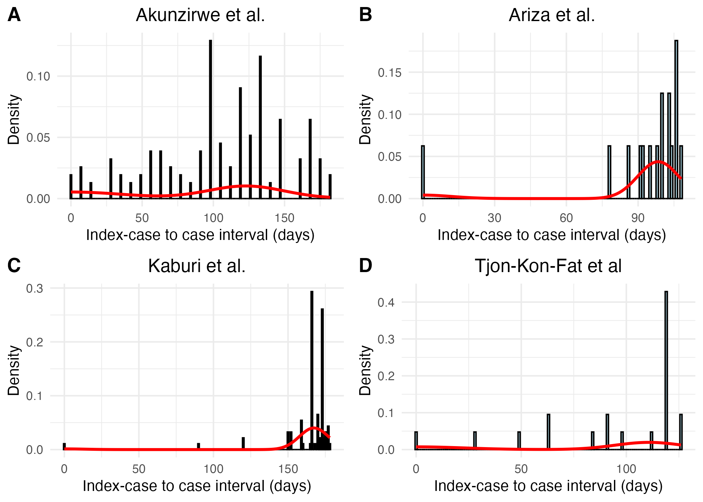
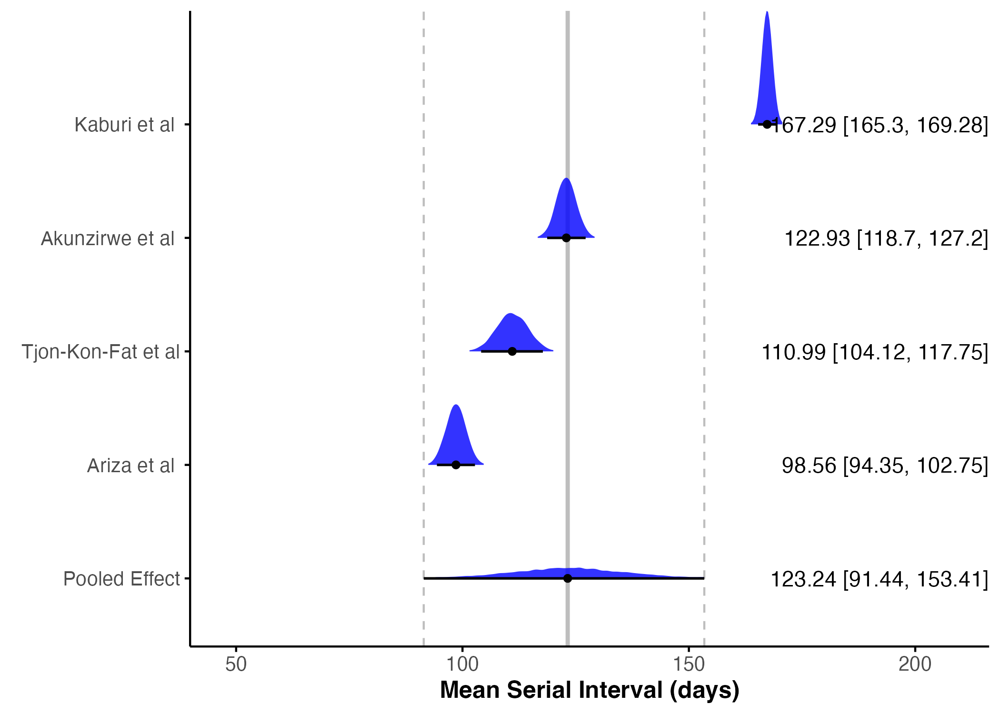
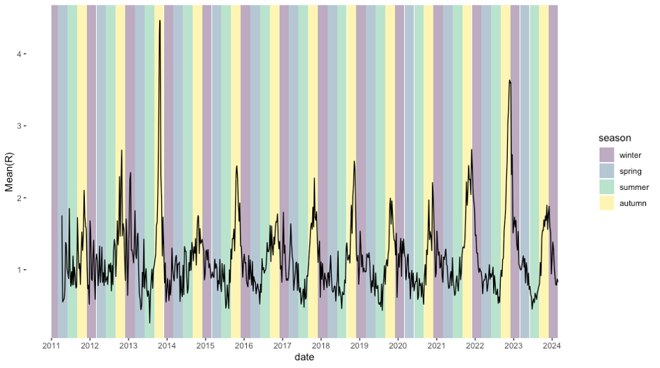
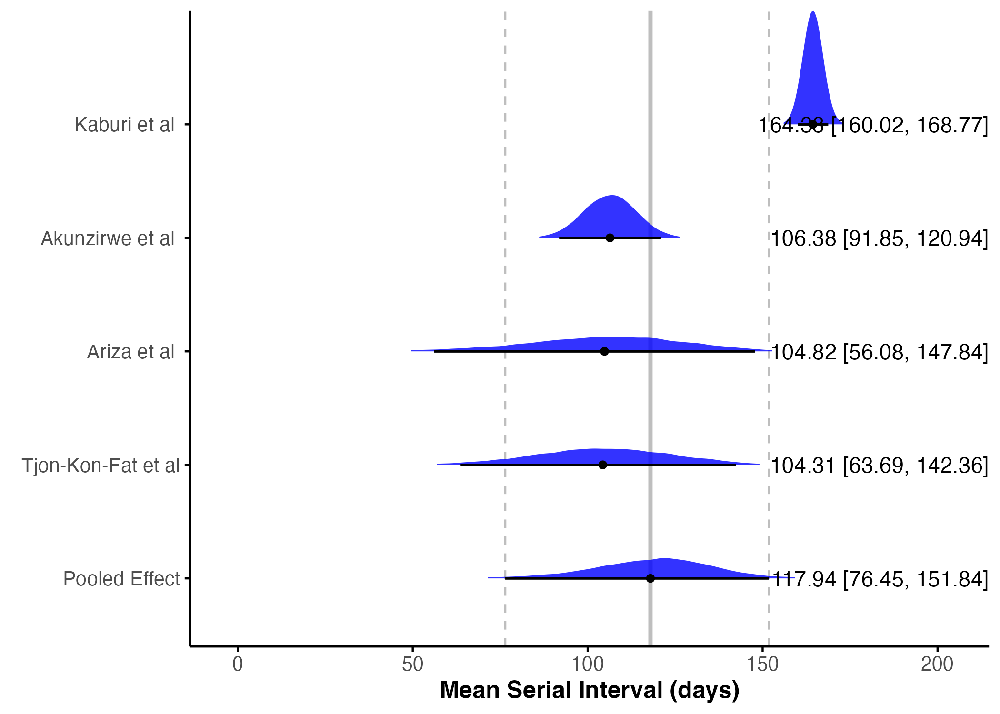

```{r, include = FALSE}
knitr::opts_chunk$set(
  collapse = TRUE,
  comment = "#>",
  fig.width=7, 
  fig.height=4
)

options(rmarkdown.html_vignette.check_title = FALSE)
```

```{r setup, echo=FALSE, include = FALSE, results='hide'}
library(bookdown)
library(flextable)
library(ftExtra)
library(openxlsx)
library(tidyverse)
library(broom)
library(nls2)
library(viridis)
library(cowplot)
library(brms)
library(officer)
library(devtools)
load_all()
```

## Introduction

Scabies is classified as a neglected tropical disease caused by
infestation of the skin with a microscopic mite (Sarcoptes scabiei)
[@who]. Symptoms are characterized by itchiness and rash at the site of
infestation. Scabies affects around 400 million people per year, and
accounts for a large proportion of skin disease in many low- and
middle-income countries [@who]. A rise in scabies cases has been
observed through out Europe in recent years [@deursen2022;
@reichert2021; @redondo-bravo2021; @lugovic-mihic2020; @amato2019;
@dona2023].

Despite the considerable burden scabies poses annually, little is known
about the disease dynamics of scabies transmission, such as the
generation time (time between infection of an index case and a secondary case), serial
interval (the time from onset of symptoms in an index case to the time
of symptom onset in a secondary case), growth rate, and reproduction
number (the average number of secondary cases resulting from one index
case). A series of studies in the 1940s by Kenneth Mellanby and colleagues
[@mellanby1944; @mellanby1972] form much of the basis of our current understanding of
scabies transmission. Some important results from the experiments performed in the 1940s by Mellanby and colleagues include an estimation of the incubation period, or time to symptom onset, of 4-6 weeks; the change in parasite rate, defined as the number of mature female mites, over time, which was shown to increase rapidly, peak around 100 days, and then decline quickly; and the probability of transmission via a secondary object (e.g., bed sheets) is low and most transmission occurs from person-to-person contact [@mellaby1944].

In this work, we aim to estimate epidemiological characteristics of
scabies. It is critical to better understand the underlying disease
dynamics of scabies to 1) assess current spread and 2) inform infection
control policy. Some modelling work has been performed to study the
potential impacts of intervention strategies, such as mass drug
administration, on scabies transmission [@kinyanjui2018; @lydeamore2019;
@tellioglu2023]; however, the values used to parameterise these models
are based largely on Mellanby's 1944 study and use information about the
mite life-cycle to approximate quantities such as latent period and
infectious period. However, this information doesn't necessarily provide
good estimates for transmission potential in humans. For example,
Kinyanjui et al. [@kinyanjui2018] assume a latent period of 7-14 days to
allow for the time for the time it takes for a fertilised female mite to
reproduce and incorporate it into a susceptible-exposed-infectious model
of scabies transmission. However, this assumes an equal chance of
infectiousness despite the number of mites inhabiting an infested
individual. Mellanby [@mellanby1944] shows that the probability of onward
transmission of scabies is rare when the number of mites on an
individual is low and increases as the mite population grows. A better
approximation of the disease process can be obtained using the
generation time or serial interval; however, no such estimates exist for
scabies.

Additionally, the growth rate and reproduction number are quantities
that describe how fast an infectious disease spreads. They are also used
to determine appropriate control measures to reduce the number of
secondary infections so that an epidemic dies out. However, in the case
of scabies, the basic reproduction number, the average number of
secondary infections resulting from one index case in a completely
susceptible population, has never been described. This makes it
immensely difficult to determine what level of control measures are
needed to contain disease spread. As evidence continues to suggest that
scabies is a growing problem in European countries and remains a large
problem elsewhere, it is important to describe the epidemiological
characteristics of scabies so that the required control efforts to curb
scabies epidemics can be determined.

In this study, we use epidemic curves of scabies outbreaks from the
literature to estimate the mean serial interval of scabies. We use also data on weekly
scabies cases in the Netherlands to estimate time-varying reproduction
number and annual growth rate. To our knowledge, this is the first study to estimate these quantities for scabies.

## Methods

### Data Sources

We used publicly available data on reported symptom onset dates of
scabies cases from previously published studies of scabies outbreaks to
estimate the serial interval of scabies. When the original study data
was not provided, we reconstructed the data from the published epidemic
curves. Additionally, we used data on the incidence of scabies over time
in the Netherlands to estimate reproduction number and growth rate.
These data have been described elsewhere [@deursen2022; @hasselaar].
Briefly, we obtained weekly incidence of scabies (per 1000 people) from
2011 to 2023 as diagnosed by general practitioners (GPs) that are stored
in a nationally representative primary care database of GPs hosted by
the Netherlands Institute for Health Services Research (Nivel)
[@hasselaar]. Scabies is not a notifiable disease in the Netherlands,
and thus information on scabies cases can only be obtained from GP
diagnoses. Individuals in institutions (e.g., care homes) are generally
not taken into account in these registrations.

### Serial Interval

Using the dates of symptom onset for scabies cases from four different
studies of scabies outbreaks (Table \@ref(tab:si_results_tab)), we
estimated the mean and standard deviation of the serial interval
distribution using the method proposed by Vink et al. [@vink2014]. The
method involves calculating the index case-to-case (ICC) interval for
each person, where the person with the greatest value for number of days
since symptom onset will be considered the index case. The rest of the
individuals will have an ICC interval calculated as the number of days
between their symptom onset and the index case. We assumed a Normal
serial interval distribution. We performed a sensitivity analysis in
which a Gamma distribution was assumed as the serial interval
distribution (see \ref(appendix)).

```{r, si_analysis, echo=FALSE}
# read in data
si_data <- readRDS("data/si_data.rds")

# use method from Vink et al. to estimate SI for each study
# assume a normal distribution, then do some wrangling
result_norm <- si_data %>%
  select(icc_interval, study) %>%
  group_by(study) %>%
  summarise(result = list(si_estim(icc_interval))) %>%
  mutate(
    mean = map_dbl(result, "mean"),
    sd = map_dbl(result, "sd"),
    wts = map(result, "wts")  # Store wts as a list-column
  ) %>%
  select(-result) %>%
  unnest(wts) %>% # Unnest the wts column if needed %>%
  pivot_longer(
    cols = c(mean, sd, wts),
    names_to = "statistic",
    values_to = "value"
  ) %>%
  group_by(study, statistic) %>%
  mutate(
    occurrence = row_number(),
    statistic = if_else(statistic == "wts", paste0("weight_", occurrence), statistic)
  ) %>%
  filter(statistic != "mean" | occurrence == 1) %>%
  filter(statistic != "sd" | occurrence == 1) %>%
  select(-occurrence) %>%
  ungroup()

# Reshape results from long to wide format
result_norm_wide <- result_norm %>%
  pivot_wider(
    names_from = statistic,
    values_from = value
  )

```

We also performed a Bayesian meta-analysis using the `brms` package in R
[@burkner2017] to estimate the pooled mean serial interval. We used a
Bayesian hierarchical random-effects model. We chose to use a random
effects model because we assume that each study has its own “true”
serial interval, which has been sampled from an overarching distribution
of true serial intervals [@harrer]. We specified a prior distribution
N(100,50) for the true pooled mean and Cauchy(0,1) for the between-study
heterogeneity. We performed sensitivity analyses on our choices of prior
distributions (see \\ref(appendix)).

```{r, meta_analysis, echo=FALSE, message=FALSE, results='hide', warning=FALSE}
# merge si_data and result_norm_wide for plotting
df_merged <- si_data %>%
  select(study, icc_interval) %>%
  left_join(result_norm_wide, by = "study", relationship = "many-to-many")

# Perform a Bayesian meta-analysis
df_ma <- df_merged %>%
  group_by(study) %>%
  mutate(n = n()) %>%
  slice(1) %>%
  ungroup() %>%
  mutate(se = sd/sqrt(n)) %>%
  select(study, n, mean, sd, se) %>%
  # don't include Larrosa and DPBH because their study periods are too short
  filter(study %in% c("Akunzirwe et al.",
                      "Ariza et al.",
                      "Kaburi et al.",
                      "Tjon-Kon-Fat et al"))

# we will perform a Bayesian meta-analysis using the {brms} package
# specify priors
priors <- c(prior(normal(100,50), class = Intercept),
            prior(cauchy(0,1), class = sd))

# fit a random effects model
# Fit the random effects model with adjusted control parameters
m.brm <- brm(
  mean | se(se) ~ 1 + (1 | study),
  data = df_ma,
  prior = priors,
  iter = 8000,  # Increased number of iterations
  warmup = 4000,  # Increased warmup
  control = list(adapt_delta = 0.999, max_treedepth = 20)  # Increased adapt_delta and max_treedepth
)
```

### Growth rate

We estimated the annual growth rate of scabies cases by fitting an
exponential growth model to annual incidence of scabies per 1000 people
from 2011 to 2023 in the Netherlands [@nivel]. We assumed normally
distributed errors, with mean zero and constant variance. Using the
fitted exponential growth model and the estimated growth rate, we then
determined the projected incidence of scabies per 1000 people until 2033
if no interventions are implemented and the growth rate remains
constant. We used bootstrapping with 1000 samples to obtain 95%
confidence bounds for the projected incidence of scabies per 1000
people.

```{r, growth_rate_code, echo = FALSE}

# read in data set
scabies_inc_total <- read.xlsx("data/scabies_data_yearly.xlsx", sheet = "total") 

scabies_inc_total <- scabies_inc_total %>%
  rename(inc = `Inc.per.1.000`) %>%
  mutate(cases = as.numeric(inc),
         time = Year) %>%
  select("time", "cases")

scabies_inc_total <- scabies_inc_total %>%
  filter(!is.na(cases) & !is.infinite(cases) & !is.na(time) & !is.infinite(time))

# Define the exponential growth model
exponential_model <- function(x, a, b) {
  a * exp(b * x)
}

### get starting values
# Center the time variable around its mean for numerical stability
scabies_inc_total <- scabies_inc_total %>%
  mutate(time_centered = time - mean(time))

# Log-transform the cases for linear regression
log_cases <- log(scabies_inc_total$cases)

# Perform linear regression on log-transformed data
lm_fit <- lm(log_cases ~ time_centered, data = scabies_inc_total)

# Extract initial values from linear regression
a_init <- exp(coef(lm_fit)[1])
b_init <- coef(lm_fit)[2]

### Fitting the model with initial values
fit <- nls(cases ~ exponential_model(time_centered, a, b),
           data = scabies_inc_total,
           start = list(a = a_init, b = b_init),
           control = list(minFactor = 0.00001, maxiter = 100000))

# Generate future time points
future_time <- seq(max(scabies_inc_total$time) + 1, max(scabies_inc_total$time) + 10, by = 1)
future_time_centered <- future_time - mean(scabies_inc_total$time)

# predict future points
predicted_values <- predict(fit, newdata = data.frame(time_centered = future_time_centered))

### Bootstrap

# Number of bootstrap samples
bootstraps <- 1000

# Initialize the counter and results storage
null_fit_count <- 0
successful_fit_count <- 0
total_iterations <- 0

# Initialize a matrix to store the bootstrap results
bootstrap_results <- matrix(NA, nrow = length(future_time), ncol = bootstraps)
boot_a <- c(rep(NA, bootstraps))
boot_b <- c(rep(NA, bootstraps))
# Bootstrap procedure
while (successful_fit_count < bootstraps) {
  total_iterations <- total_iterations + 1
  boot_indices <- sample(1:nrow(scabies_inc_total), replace = TRUE)
  boot_data <- scabies_inc_total[boot_indices, ]
  boot_fit <- tryCatch({
    nls(cases ~ exponential_model(time_centered, a, b),
        data = boot_data,
        start = list(a = a_init, b = b_init),
        control = list(minFactor = 0.00001, maxiter = 100000))
  }, error = function(e) NULL)

  if (is.null(boot_fit)) {
    null_fit_count <- null_fit_count + 1  # Increment the NULL fit counter
  } else {
    boot_a[successful_fit_count + 1] <- coef(boot_fit)[1]
    boot_b[successful_fit_count + 1] <- coef(boot_fit)[2]
    bootstrap_results[, (successful_fit_count + 1)] <- predict(boot_fit, newdata = data.frame(time_centered = future_time_centered))
    successful_fit_count <- successful_fit_count + 1  # Increment the successful fit counter
  }
}

# Calculate growth rate confidence intervals
#gr <- mean(boot_b, na.rm = TRUE)
gr_lower <- quantile(boot_b, probs = 0.025, na.rm = TRUE)
gr_upper <- quantile(boot_b, probs = 0.975, na.rm = TRUE)

# Calculate mean and confidence intervals for predictions
predicted_means <- apply(bootstrap_results, 1, mean, na.rm = TRUE)
predicted_lowers <- apply(bootstrap_results, 1, function(x) quantile(x, probs = 0.025, na.rm = TRUE))
predicted_uppers <- apply(bootstrap_results, 1, function(x) quantile(x, probs = 0.975, na.rm = TRUE))

# Combine original data with predicted values
extrapolated_df <- data.frame(time = c(tail(scabies_inc_total$time, 1), future_time),
                              cases_mean = c(tail(scabies_inc_total$cases, 1), predicted_means),
                              cases_lower = c(tail(scabies_inc_total$cases, 1), predicted_lowers),
                              cases_upper = c(tail(scabies_inc_total$cases, 1), predicted_uppers))

# Combine original and extrapolated data for plotting
scabies_plot_df <- bind_rows(
  scabies_inc_total %>% mutate(type = "Original Data", cases_mean = cases, cases_lower = NA, cases_upper = NA),
  extrapolated_df %>% mutate(type = "Extrapolated Data")
)
```

### Reproduction Number

We obtained weekly reported cases of scabies per 1000 people from 2011
to 2023 in the Netherlands [@nivel; @deursen2022]. To estimate
time-varying reproduction number, we first randomly assigned each
reported case a date of symptom onset in the week in which the case was
reported. Using the daily time series, we applied the method proposed by
Wallinga and Teunis [@wallinga_teunis2004] to estimate the time-varying
reproduction number by determining the likelihood of an event occurring
for every pair of time points [@wallinga2007]. The method requires the
specification of the serial interval distribution. We assumed a Normal
serial interval distribution with mean 91.2 days and standard deviation
22.79 days, as estimated previously. To obtain confidence intervals on
the daily reproduction number, we used bootstrapping. [TODO!] We
performed a sensitivity analysis in which we assumed the serial interval
was Gamma distributed.

All analyses were performed in R 4.4.0 [@R-base]. Additional R packages
used in this work are cited in the Appendix.

## Results

### Serial Interval

We estimated the mean and standard deviation of the serial interval
using the epidemic curves from each study (Table
\@ref(tab:si_results_tab)). There was considerable variation between
studies with the largest estimated mean serial interval of 167.34 days
(SD = 9.72 days) from data from Kaburi et al. [@kaburi2019] which
describes an outbreak in a preschool in Ghana. The smallest estimated
mean serial interval was 16.11 days (SD = 2.42 days), and was estimated
from data from Larrosa et al. [@larrosa2003] which describes an outbreak
in a hospital in Spain.

```{r si_results_tab, echo=FALSE, tab.cap="Estimated mean and standard deviation (SD) of serial interval distribution, in days, for each study."}
df_si <- result_norm_wide %>%
  select(study, mean, sd) %>%
  filter(study %in% c("Akunzirwe et al.", "Ariza et al.", "Kaburi et al.", 
                      "Tjon-Kon-Fat et al"))
ft_si <- flextable(df_si) %>%
  set_header_labels(
    study = "Study", 
    mean = "Mean", 
    sd = "Standard Deviation"
  ) %>%
  autofit(add_w = 0.2) %>%
  bold(part = "header") %>%
  border_remove() %>%
  border(i = 1, border.top = officer::fp_border(width = 1), part = "header") %>%
  border(i = 1, border.bottom = officer::fp_border(width = 1), part = "header") %>%
  border(i = nrow(df_si), border.bottom = officer::fp_border(width = 1), part = "body") 

ft_si
```

```{r si_dist_plot, echo=FALSE, eval=TRUE, fig.cap="Epidemic curves and estimated serial interval distributions from four scabies outbreaks. Red line indicates estimated serial interval density assuming an underlying normal distribution.", fig.id=TRUE}
#
# merge si_data and result_norm_wide for plotting
df_merged <- si_data %>%
  select(study, icc_interval) %>%
  left_join(result_norm_wide, by = "study", relationship = "many-to-many")

# Apply the plot_si_fit function by study
plots <- df_merged %>%
  group_by(study) %>%
  group_map(~ plot_si_fit(
    dat = .x$icc_interval,
    mean = .x$mean[1],
    sd = .x$sd[1],
    weights = c(.x$weight_1[1], .x$weight_2[1] + .x$weight_3[1],
                .x$weight_4[1] + .x$weight_5[1], .x$weight_6[1] + .x$weight_7[1]),
    dist = "normal"
  ))

# Annotate plots with study names and labels
# Find the order of the groups
group_order <- df_merged %>%
  group_by(study) %>%
  group_keys()

labeled_plots <- lapply(seq_along(plots), function(i) {
  plots[[i]] +
    ggtitle(group_order[i,1]) +            # Add study names as titles
    theme(plot.title = element_text(hjust = 0.5))  # Center the title
})

# Combine plots into a multi-pane figure
final_plot <- plot_grid(
  plotlist = labeled_plots[-c(3,5)], # exclude DPBH and Larrosa
  labels = "AUTO",      # Automatically adds labels (A, B, C, etc.)
  label_size = 14,      # Size of the labels
  ncol = 2              # Number of columns; adjust as needed
)

# Display the final combined plot
print(final_plot)
```

To obtain a pooled estimate of mean serial interval, we performed a
Bayesian meta-analysis with random intercepts for each study. We
excluded studies with study periods less than 100 days as it was
unlikely to observe a primary-secondary infection in that time. We
estimated a pooled mean serial interval of 123.24 days (95% credible
interval: 91.44, 153.41) (Figure \@ref(fig:forest_plot). As we saw
with the individual study estimates (Table \@ref(tab:si_results_tab)),
the meta-analysis provided further evidence of substantial heterogeneity
among studies due to a large value of the standard deviation of the
random intercepts (31.55). The large variation in the mean serial
interval estimates can be visualised by plotting the estimated
distributions of each study's serial interval shown in Figure
\@ref(si_dist_plot). A normal distribution is assumed, and is
parameterized by the estimated mean and standard deviation of serial
interval for each study.

```{r forest_plot, echo = FALSE, eval = TRUE, fig.cap="Forest plot of estimated mean serial intervals and pooled mean.", fig.height = 8, fig.width = 6}

```

### Growth Rate and Basic Reproduction Number

We estimated the annual growth rate of scabies cases by fitting an
exponential growth model to annual incidence of scabies per 1000 people
from 2011 to 2023 in the Netherlands [@nivel]. We estimated an annual
growth rate of 0.353 (95% CI: 0.152, 0.452). Using the estimated growth
rate, we can estimate the basic reproduction number as R0 = 1 + (0.353
\* 1/b), where b is the generation time in days [@wallinga2007]. Using
the previously estimated pooled mean serial interval (123.24 days) as a
proxy for generation time, we estimate R0 = 1.002 (1.001, 1.004). Using
the fitted exponential growth model and the estimated growth rate, we
then determined the projected incidence of scabies per 1000 people until
2033 if no interventions are implemented. We found that there could be a
substantial increase in scabies incidence in the next 10 years in the
Netherlands if no measures are taken to mitigate scabies spread (Figure
\@ref(fig:growth_rate_fig)).

```{r growth_rate_fig, echo=FALSE, message = FALSE, warning = FALSE, fig.align='center', fig.cap="Scabies incidence per 1000 people from 2011 to 2023 (points) and then projected scabies indcidence per 1000 people for 2024 to 2033 (line) using an exponential growth model with annual growth rate = 0.353. Shaded regions represent 95% confidence intervals for projected scabies incidence.", out.width="100%"}

# read in df for plot
#scabies_plot_df <- readRDS("data/scabies_gr_proj_df.rds")

# Define the custom palette
custom_palette <- c("#21908C", "#440154") # Custom colors

# Plot with custom palette and specified line and point styles
ggplot(scabies_plot_df, aes(x = time, y = cases_mean, color = type, fill = type)) +
  # Points with no line through them
  geom_point(data = filter(scabies_plot_df, type == "Original Data"), aes(y = cases), size = 2, shape = 16) +
  # Line with points for other types
  geom_line(data = filter(scabies_plot_df, type != "Original Data"), aes(y = cases_mean), linewidth = 1.2) +
  geom_point(data = filter(scabies_plot_df, type != "Original Data"), aes(y = cases), size = 2, shape = 16) +

  # Ribbon for the confidence interval
  geom_ribbon(aes(ymin = cases_lower, ymax = cases_upper, fill = type), alpha = 0.2, color = NA) +

  # Labels and theme
  labs(x = "Year", y = "Incidence per 1000",
       color = "Data Type", fill = "Data Type") +
  scale_color_manual(values = custom_palette) +
  scale_fill_manual(values = custom_palette) +
  theme_minimal() +
  theme(legend.position = "right")

```

### Reproduction Number

We estimated time-varying reproduction number and plotted it against
season. It appears that peak transmissibility occurs in the autumn and
in some years extend into winter (Figure \@ref(rt_plot)).

```{r rt_plot, echo=FALSE, fig.cap="Time-varying reproduction number of scabies transmission. Colored bands denote season. Winter = December 1 – February 28 (or 29 on leap year); Spring = March 1 – May 31; Summer = June 1 – August. 31; Autumn = September 1 – November 31.", out.width="100%"}

```

Note: This is a place-holder figure.

# Discussion

Still need to flush this out.

Discuss time-series trends and population that it typically occurs in in
NL (young adults/college students)

Discuss why estimates of mean serial interval across studies are so
different (different populations and identification of symptom onset may
be delayed).

Discuss limitations of the approach and caveats for interpretation.

# References

::: {#refs}
:::

# Appendix {#appendix}

```{r render_to_word, echo=FALSE, eval=FALSE}
# To render Word
rmarkdown::render("vignettes/epidemiology_of_scabies.Rmd", output_format = "word_document")
```

## Sensitivity Analyses

### Serial Interval

Assume Gamma distribution to estimate mean serial interval

```{r, si_results_gam, echo=FALSE, eval=TRUE}
# read in data
si_data <- readRDS("data/si_data.rds")

# assume a gamma distribution
result_gam <- si_data %>%
  select(icc_interval, study) %>%
  group_by(study) %>%
  summarise(result = list(si_estim(icc_interval, dist = "gamma"))) %>%
  mutate(
    mean = map_dbl(result, "mean"),
    sd = map_dbl(result, "sd"),
    wts = map(result, "wts")  # Store wts as a list-column
  ) %>%
  select(-result) %>%
  unnest(wts) %>% # Unnest the wts column if needed %>%
  pivot_longer(
    cols = c(mean, sd, wts),
    names_to = "statistic",
    values_to = "value"
  ) %>%
  group_by(study, statistic) %>%
  mutate(
    occurrence = row_number(),
    statistic = if_else(statistic == "wts", paste0("weight_", occurrence), statistic)
  ) %>%
  filter(statistic != "mean" | occurrence == 1) %>%
  filter(statistic != "sd" | occurrence == 1) %>%
  select(-occurrence) %>%
  ungroup()

# Plot serial interval curves
# Reshape results from long to wide format
result_gam_wide <- result_gam %>%
  pivot_wider(
    names_from = statistic,
    values_from = value
  )
```

```{r gam_table, echo=FALSE}
tab_si_gam <- flextable(result_gam_wide[,c(1:3)]) %>%
  autofit(add_w = 0.2) %>%
  bold(part = "header") %>%
  border_remove() %>%
  border(i = 1, border.top = officer::fp_border(width = 1), part = "header") %>%
  border(i = 1, border.bottom = officer::fp_border(width = 1), part = "header") %>%
  border(i = dim(result_gam_wide)[1], border.bottom = officer::fp_border(width = 1), part = "body") 

tab_si_gam
```

Meta-analysis results using Gamma distribution

```{r gam_eta_analysis_fig, echo=FALSE, eval=TRUE}

```

```{r, meta_analysis_sa, echo=FALSE, eval=FALSE, message=FALSE, results='hide', warning=FALSE}

# specify alternative priors
priors2 <- c(prior(normal(50,75), class = Intercept),
            prior(cauchy(0,1), class = sd))

# fit a random effects model
# Fit the random effects model with adjusted control parameters
m.brm2 <- brm(
  mean | se(se) ~ 1 + (1 | study),
  data = df_ma,
  prior = priors2,
  iter = 8000,  # Increased number of iterations
  warmup = 4000,  # Increased warmup
  control = list(adapt_delta = 0.999, max_treedepth = 20)  # Increased adapt_delta and max_treedepth
)

# specify alternative priors
priors3 <- c(prior(normal(150,75), class = Intercept),
            prior(cauchy(0,1), class = sd))

# fit a random effects model
# Fit the random effects model with adjusted control parameters
m.brm3 <- brm(
  mean | se(se) ~ 1 + (1 | study),
  data = df_ma,
  prior = priors3,
  iter = 8000,  # Increased number of iterations
  warmup = 4000,  # Increased warmup
  control = list(adapt_delta = 0.999, max_treedepth = 20)  # Increased adapt_delta and max_treedepth
)

```

```{r, prior_sa_tab, tab.cap="Estimated pooled mean and standard deviation of serial interval under different prior distributions."}
results_tab <- data.frame(
  Prior = c("N(100, 50)", "N(50, 75)", "N(150, 50)"),
  Mean = c(123.24, 120.87, 127.15),
  SD = c(31.55, 32.22, 31.73)
) %>%
  flextable() %>%
  autofit(add_w = 0.2) %>%
  bold(part = "header") %>%
  border_remove() %>%
  border(i = 1, border.top = officer::fp_border(width = 1), part = "header") %>%
  border(i = 1, border.bottom = officer::fp_border(width = 1), part = "header") %>%
  border(i = 3, border.bottom = officer::fp_border(width = 1), part = "body") 

results_tab
```

We performed a sensitivity analysis in which we altered our choice of
prior distribution for mean serial interval. In the main analysis we
assumed a prior distribution of N(100,50). In the sensitivity analysis
we assumed a prior distribution of N(50, 75) and N(150, 50). We obtained
similar estimates of the pooled mean serial interval under the
alternative prior distributions (Table \@ref(tab:prior_sa_tab)).

## TODO:

-   more in-depth analysis of Rt

## Computing details

The additional R packages used in this work that have not previously
been mentioned or cited in the main text are `fdrtool`[@fdrtool],
`cowplot` [@cowplot], `devtools` [@devtools], `dplyr` [@dplyr],
`usethis` [@usethis], `ggplot2` [@ggplot2]. [Packages to add: flextable,
ftExtra, knitr, officer, rmarkdown, testthat]
